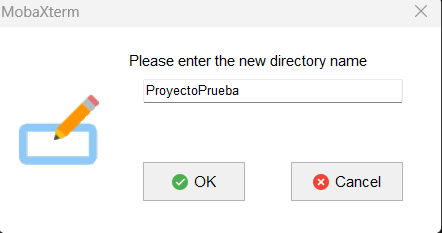
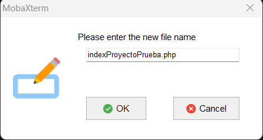
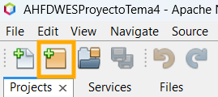
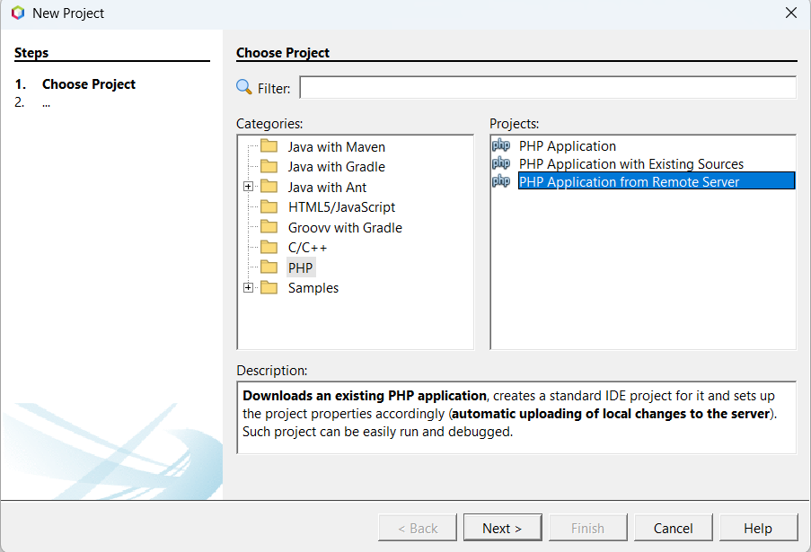
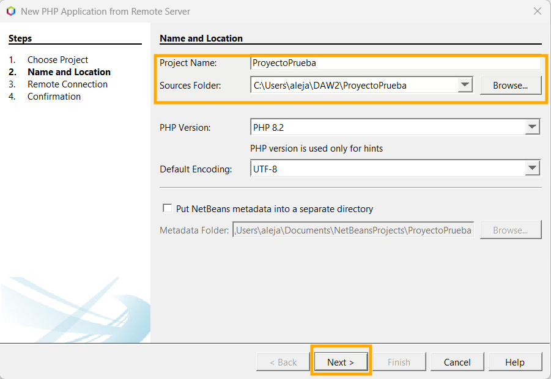
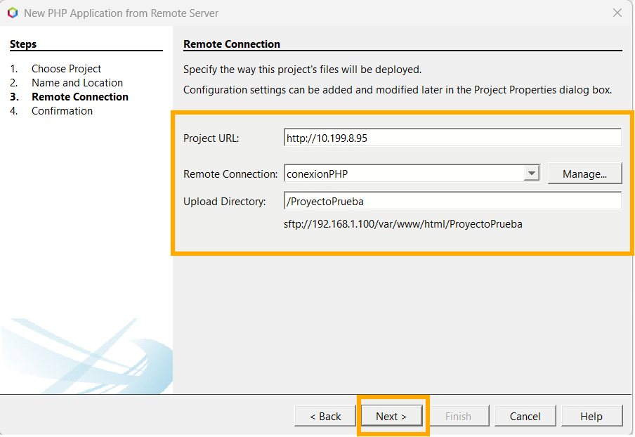
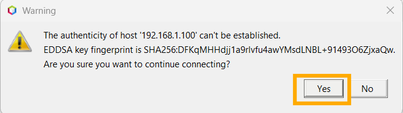

# CLIENTE DE DESARROLLO
|  DAW/DWES Tema2 |
|:-----------:|
||
| INSTALACIÓN, CONFIGURACIÓN Y DOCUMENTACIÓN DEL CLIENTE DE DESARROLLO |


- [CLIENTE DE DESARROLLO](#cliente-de-desarrollo)
    - [Windows 11](#windows-11)
      - [1.1 **Configuración inicial**](#11-configuración-inicial)
        - [**Nombre y configuración de red**](#nombre-y-configuración-de-red)
        - [**Cuentas administradoras**](#cuentas-administradoras)
      - [1.2 **Navegadores**](#12-navegadores)
      - [1.3 **MobaXterm**](#13-mobaxterm)
      - [Descargar](#descargar)
        - [Conexión por SSH](#conexión-por-ssh)
        - [Conexión por SFTP](#conexión-por-sftp)
      - [1.4 **Netbeans**](#14-netbeans)
        - [Creacion de proyectos](#creacion-de-proyectos)
        - [Eliminacion de proyectos](#eliminacion-de-proyectos)
        - [Informacion del IDE](#informacion-del-ide)
      - [1.5 **Visual Studio Code**](#15-visual-studio-code)
        - [Como crear un Workspace](#como-crear-un-workspace)
        - [Conexion SFTP con maquina de desarrollo](#conexion-sftp-con-maquina-de-desarrollo)
        - [Control de versiones](#control-de-versiones)
        - [Debug PHP (Xdebug)](#debug-php-xdebug)
        - [Connexion con la BBDD (MariaDB)](#connexion-con-la-bbdd-mariadb)
        - [Informacion del IDE](#informacion-del-ide-1)
    - [Documentación](#documentación)
      - [Requisitos mínimos](#requisitos-mínimos)
      - [Instalación de php en Windows](#instalación-de-php-en-windows)
      - [Descarga de phpDocumentor](#descarga-de-phpdocumentor)
      - [Visual Studio Code](#visual-studio-code)
      - [NetBeans](#netbeans)

###  Windows 11
#### 1.1 **Configuración inicial**
##### **Nombre y configuración de red**
##### **Cuentas administradoras**
#### 1.2 **Navegadores**

#### 1.3 **MobaXterm**

#### Descargar

> **Versión MobaXterm**: MobaXTerm Portable versión 25.2

> **Enlance de descargar**: https://mobaxterm.mobatek.net/download-home-edition.html


##### Conexión por SSH

Para crear una nueva conexión por SSH, le damos aqui (Session):


Se abrira un menu para elegir el tipo de conexion.
Elegiremos SSH y pondremos la IP del servidor, marcamos la casilla y ponemos nuestro uruario.


Al darle a Ok nos pedira la contraseña. Se la ponemos y ya estaria creada la sesion para poder administrar el servidor.

##### Conexión por SFTP

El primer paso sera darle al boton de Session para crear una nueva sesión.


Se nos abrira una ventana debajo la cual debemos de rellenar con los datos solicitados.


Una vez rellenados los datos que nos pide le damos al botón de OK y ya tendriamos nuestra conexión SFTP.

#### 1.4 **Netbeans**


##### Creacion de proyectos

Lo primero que tendremos que hacer es crear una carpeta en nuestro almacenamiento local con el nombre del proyecto: 

> D:\ProyectosNB\ProyectoPrueba

Lo segundo que debemos hacer es realizar la creación del directorio en MobaXterm:



En este mismo directorio creamos el index PHP.



Clicamos en el boton de crear un nuevo proyecto.



---

Seleccionamos el tipo de proyecto:



---

Seleccionamos el nombre del proyecto y en la carpeta donde se va a guardar




---

Seleccionamos la direccion de nuestro servidor y a que carpeta se subiran los archivos



---

Confirmamos el mensaje que aparece y le damos a finalizar.



Confirmamos la transferencia de archivos


---

Y ya lo tenemos


##### Eliminacion de proyectos

Le damos click derecho al proyecto que queramos eliminar y seleccionamos la opción "Delete".

Una vez le damos, nos preguntara si queremos tambien eliminar todos los archivos (locales). Lo seleccionamos si queremos y le damos a "Yes". Para que se elimine.


##### Informacion del IDE

> **Pagina Oficial**: https://netbeans.apache.org/ \
> **Version**: 20 \
> **Link Descarga Version**: https://netbeans.apache.org/front/main/download/nb20/ \
> **Modulos Instalados**: 0

#### 1.5 **Visual Studio Code**

***Primero que nada, importante instalar estas extensiones. Mas adelante explicare como usar las obligatorias:***

Extensiones **obligatorias**:
[SFTP](https://marketplace.visualstudio.com/items?itemName=Natizyskunk.sftp),
[PHP Extension Pack (Xdebug & Autocompletado avanzado)](https://marketplace.visualstudio.com/items?itemName=xdebug.php-pack),
[PHP Intelephense](https://marketplace.visualstudio.com/items?itemName=bmewburn.vscode-intelephense-client),
[SQLTools](https://marketplace.visualstudio.com/items?itemName=mtxr.sqltools),
[MySQL/MariaDB Support for SQLTools](https://marketplace.visualstudio.com/items?itemName=mtxr.sqltools-driver-mysql).

Extensiones **opcionales** pero bastante utiles:
[Live Server](https://marketplace.visualstudio.com/items?itemName=ritwickdey.LiveServer),
[VirtualBox](https://marketplace.visualstudio.com/items?itemName=acherkashin.virtualbox-extension),
[JsDoc](https://marketplace.visualstudio.com/items?itemName=lllllllqw.jsdoc),
[Prettier](https://marketplace.visualstudio.com/items?itemName=esbenp.prettier-vscode)
[HTML CSS Intellisense](https://marketplace.visualstudio.com/items?itemName=ecmel.vscode-html-css).

##### Como crear un Workspace

Un workspace es una colección de una o más carpetas abiertas en una sola ventana del editor. \
Sirve para organizar proyectos y aplicar configuraciones específicas a cada uno. \
Puedes guardar estas colecciones como un archivo ``.code-workspace`` con formato **JSON** para editar y compartir fácilmente la configuracion. (Muy recomendado para despues)

Para crearlo, primero abrimos una ventana vacia sin ninguna carpeta abierta con ``Ctrl + Shift + N``. \
Una vez abierta, arriba del todo a la izquierda. Le damos a ***File > Add Folder to Workspace...*** \
Nos abrira un explorador. Yo recomiendo que; en el directorio que prefieras, crees una carpeta para el workspace, y dentro se cree una carpeta para cada proyecto. Algo asi:
```
D:\
└── ProyectosWebDAW -> (Carpeta Workspace)
    ├── xxxDAWProyectoDAW
    ├── xxxDWECProyectoDWEC -> (Carpeta proyecto)
    ├── xxxDWESProyectoDWES
    ├── xxxProyectoDAW
    └── ...
```
> *Si ya estan los proyectos creados del netbeans, la carpeta del workspace seria "D:\Proyectos_NetBeans" (O como se llame la carpeta).*

Una vez creadas las carpetas. Seleccionamos las carpetas **DENTRO** de ***ProyectosWebDAW***, no la carpeta ***ProyectosWebDAW*** en si. (Se pueden seleccionar todas a la vez)

Una vez hecho. En el explorador del editor apareceran los diferentes proyectos. 

> **IMPORTANTE**: Ir al ***File > Save Workspace As...*** y guardarlo *(Preferiblemente en la carpeta del workspace)*. Es necesario para algunas configuraciones mas tarde.

##### Conexion SFTP con maquina de desarrollo

En cada proyecto creamos una carpeta llamada ``.vscode/`` y que dentro tenga el archivo ``sftp.json``. (O se hace una vez y copiamos y pegamos la carpeta mas rapido).

El archivo tiene que tener este formato (modificar ``name``, ``host`` y ``remotePath``, y borrar los comentarios para que funcione):
```json
{
  "name": "NombreConexion",
  "context": ".", # Carpeta donde se suben/descargan los archivos en local ('.' = carpeta proyecto)
  "host": "10.199.8.95",
  "username": "operadorweb",
  "password": "paso", # Si no se pone te pregunta cada vez que cierres y abres el editor
  "remotePath": "/var/www/html/PROYECTO", # Carpeta donde se suben/descargan los archivos en el servidor
  "uploadOnSave": true, # Sube archivos automaticamente al modificar
  "ignore": [
      ".git",
      ".DS_Store"
  ],
  "remoteExplorer": {
    "filesExclude": [
      ".git",
      ".DS_Store",
      ".cache",
      ".local",
      ".cache",
      ".bash_history",
      ".bashrc"
    ]
  }
}
```

Para subir/descargar archivos manualmente, podemos seleccionar el archivo en cuestion, la carpeta o el proyecto entero y darle a:
- ``Sync Local -> Remote``: Para pasar lo del local a remoto.
- ``Sync Remote -> Local``: Para pasar lo del remoto a local.
- ``Sync Both Directions``: Para pasar hacer ambos a la vez.

*(Para pasar imagenes o documentos externos se le tiene que dar manualmente siempre)*

##### Control de versiones

Para abir el panel para el control de versiones, en la barra lateral buscamos un icono con un círculo dividido con ramas; o hacemos ``Ctrl + Shift + G``.

Desde hay podemos controlar todos los git de cada proyecto (Hacer commits, cambiar ramas, crear y añadir tags, gestionar stashes, ...)

Estaria bien incluir esto en los ``.gitignore`` del proyecto:
```
.bash_history
.bashrc
.wget-hsts
.cache/
.dotnet/
.local/
.ssh/
.vscode-server/
.vscode/

*.code-workspace
nbproject/
```

##### Debug PHP (Xdebug)

Para debuggear PHP con Xdebug, primero, ir a la configuracion y buscar "**php.debug.idekey**" y ponerle el valor "**netbeans-xdebug**".

Y despues en el archivo ``.code-workspace`` al nivel de **"folders"** poner este launch *(cambiando la ruta remota y nombre del directorio local por la que corresponda)*:
```json
{
  "folders": [
    ...
  ],
  "launch": {
		"version": "0.2.0",
		"configurations": [
			{
				"name": "Listen for Xdebug",
				"type": "php",
				"request": "launch",
				"port": 9003,
				"stopOnEntry": false,
				"pathMappings": {
					"/var/www/html": "${workspaceFolder:xxxProyectoDAW}",
					"/var/www/html/xxxDAWProyectoDAW":    "${workspaceFolder:xxxDAWProyectoDAW}",
					"/var/www/html/xxxDWECProyectoDWEC":  "${workspaceFolder:xxxDWECProyectoDWEC}",
					"/var/www/html/xxxDWESProyectoDWES":  "${workspaceFolder:xxxDWESProyectoDWES}",
					"/var/www/html/xxxDWESProyectoTema3": "${workspaceFolder:xxxDWESProyectoTema3}",
					"/var/www/html/xxxDWESProyectoTema4": "${workspaceFolder:xxxDWESProyectoTema4}",
					"/var/www/html/xxxCIBProyectoCiberseguridad": "${workspaceFolder:xxxCIBProyectoCiberseguridad}"
				},
				"xdebugSettings": {
					"max_data": 2048,
				}
			}
		]
	},
}
```

Una vez hecho esto, vamos al apartado de debug de vscode buscando el icono con el triangulo de play con un insecto al lado; o presionando ``Ctrl + Shift + D``. \
Si le damos al Run **Listen for Xdebug** 

##### Connexion con la BBDD (MariaDB)

Buscamos en la barra lateral el icono de un cilindro.

Una vez en el, en el apartado ***CONNECTIONS*** le damos a ***Add New Connection***, se nos abrira un apartado para elegir la DB que queramos usar. Seleccionaremos **MariaDB**.

Se abrira aun formulario par completar la configuracion de la connexion. Lo rellenamos con los datos necesarios. (Para el usuario administrador de la base de datos, en el `Database` ponemos **mysql** para que tenga acceso a todas las BBDD)

Para ejecutar consultas, primero verificamos cual es la connexion activa con la que haremos la consulta hacemos clic aqui y seleccionamos la que queramos:


##### Informacion del IDE

> **Pagina Oficial**: https://code.visualstudio.com/ \
> **Version**: Ultima version (Actualizada automaticamente) \
> **Link Descarga**: https://code.visualstudio.com/Download \
> **Extensiones Instaladas**: Las de arriba


### Documentación

En este apartado vamos a ver a como realizar la documentación mediante phpDoc desde el Cliente de Desarrollo ya sea Visual Studio Code o NetBeans.

#### Requisitos mínimos

* Sistema Operativo: Windows 10 o superior.
* PHP: Versión 8.1 o superior.
* Visual Studio Code.
* NetBeans.
* Extensiones php requeridas (DOM, XML, SimpleXML).
* Espacio de almacenamiento (Al menos 100MB para PHP y phpDocumentor).

#### Instalación de php en Windows

* Lo primero que debemos hacer sera descargar php para Windows: https://windows.php.net/download/

* Descargaremos la versión Thread Safe en formato .zip:


* Extramos el contenido en una carpeta.
* Lo siguiente sera realizar la **configuración de las variables de entorno de nuestro sistema.**
* Click derecho en "Este equipo" -> Propiedades -> Configuración avanzada del sistema -> Variables de entorno.

* En las variables editaremos la variable **Path.**
* Agregamos la ruta donde hemos puesto nuestro .exe
* Aceptamos y cerramos.


* Verificamos la instalación de PHP desde el cmd de Windows.

```bash
php -v
```


#### Descarga de phpDocumentor

Una vez instalado php en nuestro Cliente de desarrollo lo que debemos hacer sera descargar phpDocumentor:

* Visitamos la página oficial: https://docs.phpdoc.org/guide/getting-started/installing.html
* Descargamos el archivo phpDocumentor.phar :    https://phpdoc.org/phpDocumentor.phar
* Guardamos el archivo en una ruta accesible : C:\Users\aleja\DAW2\Documentacion.

#### Visual Studio Code

En este apartado vamos a ver como configurar y realizar la documentación con phpDocumentor desde Visual Studio Code.

* Lo primero que debbemos tener en cuenta es que Visual Studio Code no genera documentación por si mismo, aqui 
  todo se hace mediante la terminal.

  1. Abrimos nuestro proyecto en Visual Studio Code.
  2. Abrimos la terminal con la ruta de nuestro proyecto.
  3. Comprobamos que la consola de VS Code reconoce el comando de php.

  

  **Si no lo reconoce , reiniciamos el Visual Studio Code**

  4. Ejecutamos phpDocumentor de Windows desde la terminal.

```bash
php C:\Users\aleja\DAW2\Documentacion\phpDocumentor.phar run -d . -t doc
```

  **Le indicamos la ruta del archivo .phar y la carpeta donde queremos que genera a documentación.**

  

  Ahora ya podemos comprobar que se ha creado la carpeta en nuestro proyecto con la documentación del mismo.


  #### NetBeans

  En el siguiente apartado vamos a ver como realizar la documentación con phpDocumentor desde NetBeans.

  * Configuración de PHP en NetBeans:

  1. Abrir NetBeans
  2. Ir a **Tools** (Herramientas) -> Options (Opciones).
  3. Seleccionamos PHP.
  4. Click en General y selecionamos la ruta del .exe

  

  * Configuración de phpDocumentor en NetBeans.

  1. Ir a **Tools** (Herramientas) -> Options (Opciones).
  2. Seleccionamos PHP.
  3. Click en Framework and Tools -> phpDocumentor -> ruta del .phar
  
  

  4. Click derecho en el proyecto -> Properties -> Documentation-> Le indicamos la ruta donde queremos que se genere la doc.

  

  * Generación de documentación desde NetBeans

  Una vez configurado el NetBeans vamos a generar la documentación.

  1. Click derecho sobre el proyecto.
  2. Seleccionamos Generate Documentation.
  3. Nos saldra en consola la realización correcta de la documentación.


