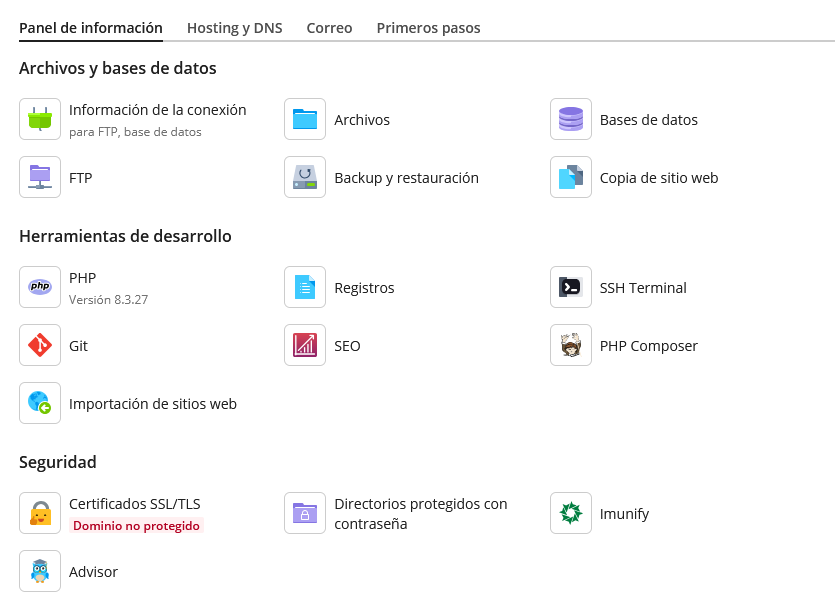
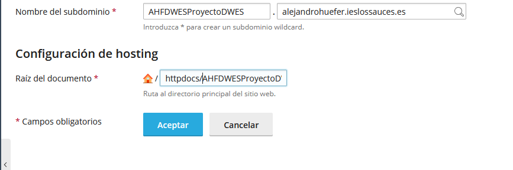
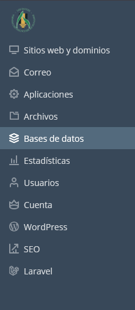
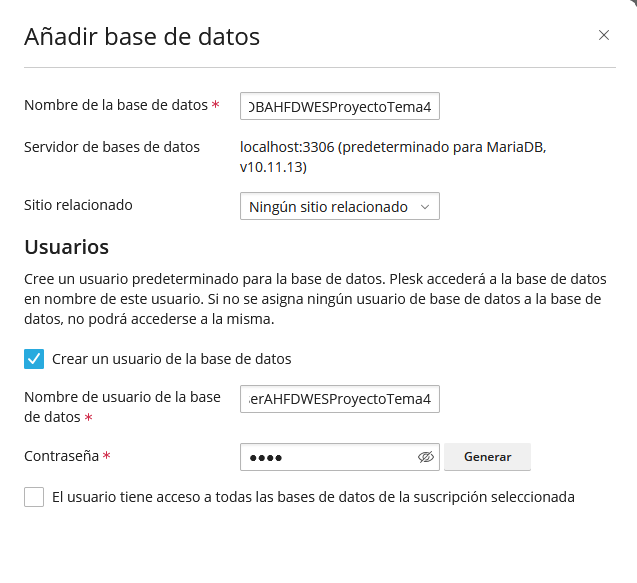
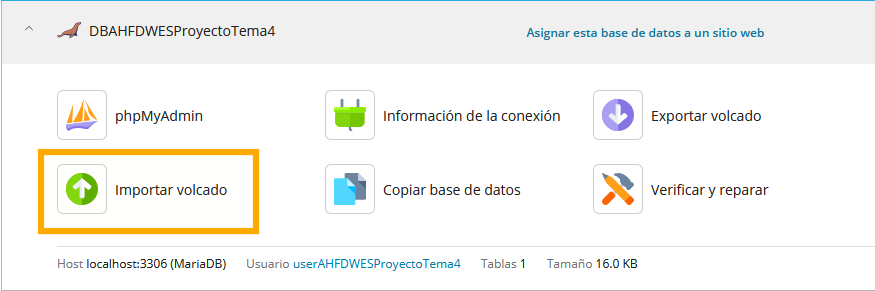
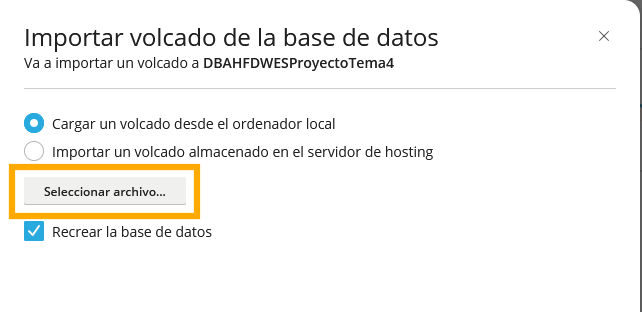

# ENTORNO DE EXPLOTACIÓN
|  DAW/DWES Tema2 |
|:-----------:|
||
| INSTALACIÓN, CONFIGURACIÓN Y DOCUMENTACIÓN DE ENTORNO DE DESARROLLO Y DEL ENTORNO DE EXPLOTACIÓN |

- [ENTORNO DE EXPLOTACIÓN](#entorno-de-explotación)
  - [PLESK](#plesk)
    - [Acceso a la cuenta del usuario](#acceso-a-la-cuenta-del-usuario)
    - [Panel general Plesk](#panel-general-plesk)
    - [Creación de los subdominios](#creación-de-los-subdominios)
    - [Importar una base de datos](#importar-una-base-de-datos)
    
## PLESK
Para el entorno de explotación se utiliza el hosting PLESK.
### Acceso a la cuenta del usuario
Se accede al enlace : https://ieslossauces.es:8443/login_up.php    
Aparece el formulario para registrarse y se indican el usuario y la contraseña.

Y se llega a la pagina principal de gestion del hosting

### Panel general Plesk

Dentro de Plesk podemos ver una interfaz la cual nos permitira administrar tanto nuestro entorno de explotacion como las diferentes areas
que se muestran a continuación.

### Creación de los subdominios
Para crear un subdominio se va al apartado sitios web y dominios del menu.

Se pincha en añadir subdominio en la parte de arriba

Se indica el nombre del subdominio

y la carpeta en la que queramos que esté, en este caso httpdocs

### Importar una base de datos

Lo primero que debemos hacer es dirigirnos al apartado Bases de datos en la 
barra lateral izquierda:

Haremos click en el boton azul que dice Añadir base de datos

Rellenamos con los datos : Nombre de la base de datos, sitio relacionado (No obligatorio), Nombre de usuario y password

Hacemos click en crear base de datos y haremos click en el apartado importar volcado:

Se nos abrira una barra lateral donde debemos adjuntar el archivo zip con el script de creación junto 
a la carga inicial (Todo en un mismo script).

Una vez realizado este proceso nuestra base de datos estara en nuestro entorno de explotación.

Hay que tener en cuenta cambiar el fichero de configuración de la base de datos de nuestro proyecto 
ya que no es el mismo que en el entorno de desarrollo.