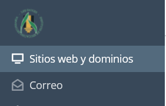
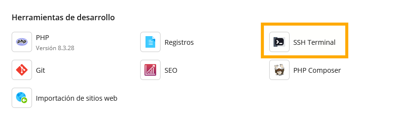

# ENTORNO DE EXPLOTACIÓN
|  DAW/DWES Tema2 |
|:-----------:|
||
| INSTALACIÓN, CONFIGURACIÓN Y DOCUMENTACIÓN DE ENTORNO DE DESARROLLO Y DEL ENTORNO DE EXPLOTACIÓN |

- [ENTORNO DE EXPLOTACIÓN](#entorno-de-explotación)
  - [PLESK](#plesk)
    - [Acceso a la cuenta del usuario](#acceso-a-la-cuenta-del-usuario)
    - [Panel general Plesk](#panel-general-plesk)
    - [Conexíon por SFTP Y SSH](#conexíon-por-sftp-y-ssh)
      - [SFTP](#sftp)
      - [SSH](#ssh)
    - [Creación de los subdominios](#creación-de-los-subdominios)
    - [Importar una base de datos](#importar-una-base-de-datos)
    - [Publicar versión estable de GitHub](#publicar-versión-estable-de-github)
    - [Fichero .htaccess](#fichero-htaccess)
    
## PLESK
Para el entorno de explotación se utiliza el hosting PLESK.
### Acceso a la cuenta del usuario
Se accede al enlace : https://ieslossauces.es:8443/login_up.php    
Aparece el formulario para registrarse y se indican el usuario y la contraseña.


Y se llega a la pagina principal de gestion del hosting

### Panel general Plesk

Dentro de Plesk podemos ver una interfaz la cual nos permitira administrar tanto nuestro entorno de explotacion como las diferentes areas
que se muestran a continuación.


### Conexíon por SFTP Y SSH

#### SFTP

Para poder conectarnos por SFTP lo primero que debemos hacer es encontrar los datos de conexión desde nuestro panel de administrador de PLesk.

Para ello en el menu desplegable de la izquierda nos dirigimos a "Sitios web y dominios"



Una vez dentro en la sección Panel de información entraremos en FTP.


Haremos click en nuestro nombre y se nos abrira una ventana lateral con toda la información necesaria para realizar la conexión por SFTP.


Estos datos son los que utilizaremos para realizar la conexión correctamente desde el MobaXterm.

#### SSH

En cuanto a la conexión por SSH tenemos dos opciones dependiendo del lugar donde queramos realizar la conexión.

**1. Conexión por SSH desde Plesk**

Para realizarla desde Plesk lo único que tenemos que hacer es dirigirnos al apartado de Sitios web y dominios que hemos visto anteriormente.

Una vez ahi esta vez elegiremos la opción de SSH Terminal.



Al hacer click se nos abre diractamente la consola con conexión SSH para nuestro Entorno de explotación.

**2. Con cliente externo (MobaXterm)**

La segunda opción es mediante el uso de un cliente externo, en nuestro caso vamos a utilizar MobaXterm.

Para realizar esta conexión debemos hacerla de la misma forma que lo hacemos en nuestro entorno de desarrollo pero esta vez con los datos que hemos visto anteriormente en la conexión SFTP.

### Creación de los subdominios
Para crear un subdominio se va al apartado sitios web y dominios del menu.


Se pincha en añadir subdominio en la parte de arriba


Se indica el nombre del subdominio

y la carpeta en la que queramos que esté, en este caso httpdocs


### Importar una base de datos

Lo primero que debemos hacer es dirigirnos al apartado Bases de datos en la 
barra lateral izquierda:


Haremos click en el boton azul que dice Añadir base de datos


Rellenamos con los datos : Nombre de la base de datos, sitio relacionado (No obligatorio), Nombre de usuario y password


Hacemos click en crear base de datos y haremos click en el apartado importar volcado:


Se nos abrira una barra lateral donde debemos adjuntar el archivo zip con el script de creación junto 
a la carga inicial (Todo en un mismo script).


Una vez realizado este proceso nuestra base de datos estara en nuestro entorno de explotación.

Hay que tener en cuenta cambiar el fichero de configuración de la base de datos de nuestro proyecto 
ya que no es el mismo que en el entorno de desarrollo.

### Publicar versión estable de GitHub

Lo primero que tenemos que hacer es una release (Versión estable de nuestro proyecto) en GitHub.

Una vez ya realizada la release debemos descargar el archivo .zip , el cual contendra la versión estable del proyecto.

Descomprimimos y subimos a nuestro servidor de explotación por SFTP utilizando la conexión realizada anteriormente.

 
### Fichero .htaccess

Contenido del fichero .htaccess para las diferentes opciones y caracteristicas de nuestro entorno de explotación.

````Bash
# Redirección a indice personalizado
directoryindex indexProyectoDWES.php

# Para que funcione el metodo head('WWW-Authenticate: Basic realm="Contenido restringido"') en php
<IfModule mod_rewrite.c>
    RewriteEngine on
    RewriteRule .* - [E=HTTP_AUTHORIZATION:%{HTTP:Authorization}]
</IfModule>

# Redirección de errores a paginas personalizadas en carpeta error de raiz del dominio/subdominio
ErrorDocument 404 /error/404.html
ErrorDocument 403 /error/403.html
ErrorDocument 500 /error/500.html

# Redirección http a https (cambiar ip de https)
RewriteEngine On
RewriteCond %{SERVER_PORT} 80
RewriteRule ^(.*)$ https://10.199.8.199/$1 [R,L]


````