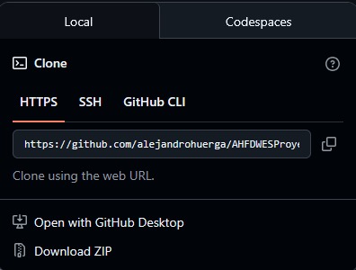

# CFGS Desarrollo de Aplicaciones Web

- [CFGS Desarrollo de Aplicaciones Web](#cfgs-desarrollo-de-aplicaciones-web)
- [3-Git-y-GitHub](#3-git-y-github)
    - [3.1 **Git**](#31-git)
    - [**Descargar e instalación**](#descargar-e-instalación)
        - [1. Descargar Git](#1-descargar-git)
        - [2. Instalar Git.](#2-instalar-git)
          - [Comprobar si Git se ha instalado correctamente.](#comprobar-si-git-se-ha-instalado-correctamente)
      - [3. Configuracion](#3-configuracion)
          - [Configuracion nombre y correo](#configuracion-nombre-y-correo)
          - [Verificación de la configuración](#verificación-de-la-configuración)
      - [4. Trabajar con el repositorio](#4-trabajar-con-el-repositorio)
        - [Clonación de un repositorio de GitHub](#clonación-de-un-repositorio-de-github)
        - [Subida de nuestro trabajo a GitHub](#subida-de-nuestro-trabajo-a-github)
      - [6. Comandos básicos de git](#6-comandos-básicos-de-git)

# 3-Git-y-GitHub

### 3.1 **Git**

Git es un
sistema de control de versiones distribuido y de código abierto que se utiliza principalmente para gestionar el historial de cambios en archivos de código fuente, permitiendo que múltiples desarrolladores colaboren en un proyecto de manera simultánea.

### **Descargar e instalación**

##### 1. Descargar Git

1. Se accede al sitio oficial de Git:
    [https://git-scm.com/downloads](https://git-scm.com/downloads)
2. Se hace clic en **Windows**.
   Se descarga la versión acorde con su equipo. Existe una versión de escritorio y una portable.
    Al pinchar en el enlace de la versión, que se quiera, la descarga comenzará automaticamente.

---

##### 2. Instalar Git.

1. Se ejecuta el instalador .exe que acabamos de descargar.
   
2. Se aceptan los términos de licencia y se siguen las siguientes pautas de instalación:
   * **Carpeta de instalación :** se puede dejar la que viene preterminada
   * **Select components :** Dejamos los que vienen preterminados.
   * **Start menu folder :** Dejamos lo que viene por defecto.
   * **Editor por defecto :** Aqui deberemos elegir el editor al cual le demos preferencia o aquel con el que nosotros trabajemos.
   * **Name of the initial branch :** Podemos dejar la que viene preterminada , pero si nosotros trabajamos con otro nombre podemos editar esta información para no tener que cambiarla cada vez que iniciemos un repositorio.
   * **PATH enviroment :** `Git from the command line and also from 3rd-party software`.
   * **SSH executable:** se puede dejar la que viene por defecto(bundle ssh) para poder utilizar openSSH. .
   * **HTTPS transport backend:** se puede dejar la que viene por defecto para poder utilizar la libreria de windows .
   * El resto de opciones puedes dejarlas por defecto.

3. Se empieza con la instalación haciendo clic en **Instalar**.
   
4. Finaliza la instalación haciendo clic en **Finish**.

###### Comprobar si Git se ha instalado correctamente.

1. En primer lugar abriremos el símbolo del sistema (CMD),la PowerShell,la terminal de VS Code o Git Bash.
   
2. Dentro de una de las terminales escribiremos el siguiente comando: 
   
   ```bash
        git --version
   ```

3. La salida debe de ser algo como esto:
   
   ```bash
        git version 2.48.1.windows.1
   ```
#### 3. Configuracion 

###### Configuracion nombre y correo

1. Para configurar el nombre y el correo escribiremos el siguiente comando en nuestra terminal:
    Hay que tener en cuenta que estos son los datos que apareceran en los commits.

    ```bash
        git config --global user.name "Nombre"
        git config --global user.email "email@ejemplo.com"
   ```

###### Configuracion del editor de texto por defecto (opcional)

1. Aunque en la instalación hemos decidido el editor de texto , este comando nos permitira cambiar de editor por
    defecto en cualquier momento.

    ```bash
        git config --global core.editor "editorDeTexto"
   ```

###### Verificación de la configuración

1. Para ver o mostrar la configuración que tenemos utilizaremos el siguiente comando:

    ```bash
        git config --list
   ```
2. Una vez listada la configuración podemos ver parametros como estos: 

    ```bash
        init.defaultbranch=master (Nombre de la rama al inicializar un repo)
        user.name=username elegido
        user.email=correo elegido
   ```
#### 4. Trabajar con el repositorio

##### Clonación de un repositorio de GitHub

Para realizar la clonación de un repositorio de GitHub , primero debemos de tener una cuenta en GitHub.

1. Creación de una cuenta de GitHub.
2. Buscamos el repositorio el cual queremos clonar.
3. Una vez encontrado el repositorio vamos a la siguiente sección (Code<>):

    .

4. Lo siguiente sera copiar la dirección HTTP del Repositorio:

    .

5. Abrimos cualquier consola en la carpeta que queremos clonar el repositorio 
   y escribiremos el siguiente comando:

    ```bash
        git clone '<URL del proyecto>'
   ```

6. La salida por consola debe de ser la siguiente:

    ```bash
        Cloning into '<nombre_del_repositorio>'...
        Done
   ```

7. Tendriamos el repositorio disponible para trabajar en local.


##### Subida de nuestro trabajo a GitHub

Una vez que hayamos trabajado en nuestro proyecto es momento de coordinar los cambios con nuestro repositorio remoto.

1. **Lo primero que debemos hacer es Add (Agregar los cambios):**

    ```bash
        git add .
   ```
   *Podemos poner . si queremos agregar todos los cambios o solo el nombre de los archivos que queramos agregar.*


2. **Hacemos commit de los cambios en el area de stage:**

    *El commit nos permite especificar que tipos de cambios y donde los hemos hecho dentro del repositorio.*

    ```bash
        git commit
   ```

   *Se nos abrira el editor de texto por defecto que hemos configurado y debemos escribir el mensaje del commit.*

   ```bash
        git commit -m 'mensaje del commit'
   ```

   *De esta otra manera podemos indicar el mensaje directamente desde el mismo comando.*

3. **Subimos el commit a GitHub**

    *Para poder subir los cambios realizados utilizamos el siguiente comando*

    ```bash
        git push '<nombre del repositorio remoto>' '<rama que queremos subir>'
   ```

4. **Comprobamos que los cambios se han subido al repositorio remoto**

#### 6. Comandos básicos de git

  *El siguiente enlace de la web oficial de git nos muestra una guia con los comandos mas básicos para comenzar en git*

  https://git-scm.com/cheat-sheet