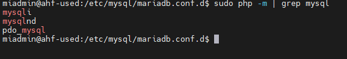
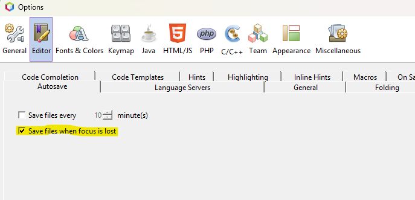
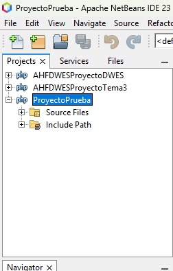

# CFGS Desarrollo de Aplicaciones Web

|  CFGS DESARROLLO  DE APLICACIONES WEB |
|:-----------:|
||
| DESPLIEGUE DE APLCIACIONES WEB
| CYBERSEGURIDAD
| DAWES Tema 2. INSTALACIÓN, CONFIGURACIÓN Y DOCUMENTACIÓN DE ENTORNO DE DESARROLLO Y DEL ENTORNO DE EXPLOTACIÓN |


- [CFGS Desarrollo de Aplicaciones Web](#cfgs-desarrollo-de-aplicaciones-web)
  - [1. Entorno de Desarrollo](#1-entorno-de-desarrollo)
    - [1.1 Ubuntu Server 24.04.3 LTS](#11-ubuntu-server-24043-lts)
      - [1.1.1 ***Configuración inicial***](#111-configuración-inicial)
        - [Nombre y configuraicón de red](#nombre-y-configuraicón-de-red)
        - [Comprobar el nombre de la maquina](#comprobar-el-nombre-de-la-maquina)
        - [Cambiar nombre de la maquina](#cambiar-nombre-de-la-maquina)
        - [Comprobar el nombre de la maquina en el archivo hosts:](#comprobar-el-nombre-de-la-maquina-en-el-archivo-hosts)
        - [Editar el fichero de configuración del interface de red:](#editar-el-fichero-de-configuración-del-interface-de-red)
        - [Actualizar configuración de red](#actualizar-configuración-de-red)
        - [Actualizar el sistema](#actualizar-el-sistema)
        - [Configuración fecha y hora](#configuración-fecha-y-hora)
        - [Cuentas administradoras](#cuentas-administradoras)
        - [Ver cuentas de usuario](#ver-cuentas-de-usuario)
        - [Creacion de usuario](#creacion-de-usuario)
        - [Agregarlo al grupo sudo](#agregarlo-al-grupo-sudo)
        - [Cambiar entre usuarios](#cambiar-entre-usuarios)
        - [Habilitar cortafuegos](#habilitar-cortafuegos)
        - [Comprobación del estado del cortafuegos](#comprobación-del-estado-del-cortafuegos)
        - [Abrimos el puerto 22](#abrimos-el-puerto-22)
        - [Borrar regla V6 del cortafuegos](#borrar-regla-v6-del-cortafuegos)
        - [Instalación del servicio ssh](#instalación-del-servicio-ssh)
        - [Comprobación del servicio ssh](#comprobación-del-servicio-ssh)
      - [1.1.2 Instalación del servidor web HTTP](#112-instalación-del-servidor-web-http)
        - [Instalación](#instalación)
          - [Actualizamos Ubuntu server](#actualizamos-ubuntu-server)
          - [Instalamos apache2](#instalamos-apache2)
          - [Abrimos el puerto 80](#abrimos-el-puerto-80)
          - [Comprobamos en el navegador](#comprobamos-en-el-navegador)
        - [Verficación del servicio](#verficación-del-servicio)
        - [Creación usuario: operadorweb](#creación-usuario-operadorweb)
          - [Asignar password](#asignar-password)
          - [Cambiar propietario de la carpeta donde se aloja la documentación](#cambiar-propietario-de-la-carpeta-donde-se-aloja-la-documentación)
          - [Cambiamos los permisos para acceso a archivos](#cambiamos-los-permisos-para-acceso-a-archivos)
        - [Virtual Hosts](#virtual-hosts)
        - [Permisos y usuarios](#permisos-y-usuarios)
      - [1.1.3 PHP -FPM](#113-php--fpm)
        - [Instalación](#instalación-1)
        - [Configuración](#configuración)
        - [Monitorización](#monitorización)
      - [1.1.4 MariaDB](#114-mariadb)
      - [1.1.5 XDebug](#115-xdebug)
      - [1.1.6 Servidor web seguro (HTTPS)](#116-servidor-web-seguro-https)
      - [1.1.7 DNS](#117-dns)
      - [1.1.8 SFTP](#118-sftp)
      - [1.1.9 Apache Tomcat](#119-apache-tomcat)
      - [1.1.10 LDAP](#1110-ldap)
    - [1.2 Windows 11](#12-windows-11)
      - [1.2.1 **Configuración inicial**](#121-configuración-inicial)
        - [**Nombre y configuración de red**](#nombre-y-configuración-de-red)
        - [**Cuentas administradoras**](#cuentas-administradoras-1)
      - [1.2.2 **Navegadores**](#122-navegadores)
      - [1.2.3 **MobaXterm**](#123-mobaxterm)
        - [Configuración](#configuración-1)
      - [1.2.4 **Netbeans**](#124-netbeans)
          - [Creación , eliminación y modificación de proyectos:](#creación--eliminación-y-modificación-de-proyectos)
      - [1.2.5 **Visual Studio Code**](#125-visual-studio-code)
  - [2. GitHub](#2-github)
  - [3.Entorno de Explotación](#3entorno-de-explotación)

## 1. Entorno de Desarrollo

### 1.1 Ubuntu Server 24.04.3 LTS

Este documento es una guía detallada del proceso de instalación y configuración de un servidor de aplicaciones en Ubuntu Server utilizando Apache, con soporte PHP y MySQL

Descargar Sistema Operativo:

#### 1.1.1 ***Configuración inicial***

##### Nombre y configuraicón de red

> **Nombre de la máquina**: xxx-used\
> **Memoria RAM**: 2G\
> **Particiones**: 150G(/) y resto (/var)\
> **Configuración de red interface**: xxxx \
> **Dirección IP** :10.199.8.195/22
> **GW**: xx.xx.xx.xx/22\
> **DNS**: 10.151.123.21

##### Comprobar el nombre de la maquina
```bash
hostname
```

##### Cambiar nombre de la maquina
```bash
sudo hostnamectl set-hostname ahf-used
```
##### Comprobar el nombre de la maquina en el archivo hosts: 

```bash
sudo nano /etc/hosts
```
##### Editar el fichero de configuración del interface de red:  
```bash
sudo nano /etc/netplan/
```

```bash

# This is the network config written by 'subiquity'
network:
  ethernets:
    enp0s3:
      addresses:
       - 10.199.8.195/22
      nameservers:
         addresses:
         - 10.151.123.21
         - 10.151.126.21
         search: [dominio]
      routes:
      - to: default
        via: 10.199.8.1
  version: 2
````
##### Actualizar configuración de red

```bash
sudo netplan apply
```

##### Actualizar el sistema

```bash
sudo apt update
sudo apt upgrade
```

##### Configuración fecha y hora

```bash
sudo timedatectl set-timezone Europe/Madrid
```
**Link con tutorial:**
[ Establecer fecha, hora y zona horaria](https://somebooks.es/establecer-la-fecha-hora-y-zona-horaria-en-la-terminal-de-ubuntu-20-04-lts/ "Cambiar fecha y hora")

##### Cuentas administradoras

> - [X] root(inicio)
> - [X] miadmin/paso
> - [X] miadmin2/paso

##### Ver cuentas de usuario 

```bash
cat /etc/passwd | grep miadmin
```

##### Creacion de usuario

```bash
sudo adduser miadmin2
```

##### Agregarlo al grupo sudo

```bash
sudo usermod -aG sudo miadmin2
```

##### Cambiar entre usuarios 

```bash
sudo su - miadmin2
```


##### Habilitar cortafuegos

```bash
sudo ufw enable
```

##### Comprobación del estado del cortafuegos

```bash
sudo ufw status
```

##### Abrimos el puerto 22

```bash
sudo ufw allow 22
````

##### Borrar regla V6 del cortafuegos

1. Numeramos los procesos abiertos 

```bash
sudo ufw status numbered
```

2. Borramos el numero de regla al que pertenece V6

```bash
sudo ufw delete (numero de regla)
```
##### Instalación del servicio ssh

```bash
sudo apt update
```

```bash
sudo apt install openssh-server
```

##### Comprobación del servicio ssh

```bash
sudo systemctl status ssh
```

 1. Si esta desactivado lo activamos
   
```bash
sudo systemctl enable ssh
```

2. Una vez activado comprobamos la conexión desde el anfitrión
   
```cmd
ssh nombreUsuarioMaquina@IPmaquina
```

#### 1.1.2 Instalación del servidor web HTTP

##### Instalación

###### Actualizamos Ubuntu server
```bash
sudo apt update
```

###### Instalamos apache2
```bash
sudo apt install apache2
```

###### Abrimos el puerto 80
```bash
sudo ufw allow 80
```


###### Comprobamos en el navegador
http://ipMaquina

Si lo hemos hecho correctamente nos saldra una página de Ubuntu server con el mensaje 
"It works!"

##### Verficación del servicio

```bash
sudo systemctl status apache2
```


##### Creación usuario: operadorweb

```bash
sudo useradd -M -d /var/www/html -N -g www-data -s /bin/bash operadorweb
```

###### Asignar password

```bash
sudo passwd operadorweb xxx
```

###### Cambiar propietario de la carpeta donde se aloja la documentación

```bash
sudo chown -R operadorweb www-data /var/www/html
```

###### Cambiamos los permisos para acceso a archivos

```bash
sudo chmod -R 775 /var/www/html
```
##### Virtual Hosts
##### Permisos y usuarios

#### 1.1.3 PHP -FPM
##### Instalación 

En este apartado vamos a ver la forma de instalar el servicio de php en nuestro Ubuntu Server con Apache instalado.

1. Actualizamos el sistema: 

```bash
sudo apt update
```

2. Agregamos el repositorio PPA de Ondrej

```bash
sudo apt install software-properties-common -y
```
```bash
sudo add-apt-repository ppa:ondrej/php -y
```

3. Comprobamos si se ha instalado
   
```bash
ls /etc/apt/sources.list.d/ | grep ondrej
```

4. Volvemos a actualizar el sistema
   
```bash
sudo apt update
```

5. Instalamos PHP-FPM y módulos apache
   
```bash
sudo apt install libapache2-mod-php8.3 php8.3-fpm -y
```
```bash
sudo a2enmod proxy_fcgi
```

6. Desactivamos php8.3 y prefork
   
```bash
sudo a2dismod php8.3
```
```bash
sudo a2dismod mpm_prefork
```
7. Activamos el evento proxy-fcgi y php 8.3-fpm
   
```bash
sudo a2enmod mpm_event proxy_fcgi
```
```bash
sudo a2enconf php8.3-fpm
```
8. Reniciamos el servicio de apache
   
```bash
sudo systemctl restart apache2
```
9. En el MobaXterm creamos el archivo "info.php" en el directorio raiz 
    
> /var/www/html/


El archivo llevara las siguiente lineas de código php:

```php
<?php
  phpinfo();
?>
```
10. Comprobamos en el servidor el documento php que se nos genera

> http://ipServidor/info.php

Veremos la información de nuestro servicio Php


##### Configuración

11. Vamos al siguiente directorio

```bash
cd /etc/php/8.3/fpm
```

12. Hacemos copia de seguridad del archivo php.ini

```bash
sudo cp php.ini php.ini.backup
```

13. Editamos el archivo php.ini

```bash
sudo nano php.ini
```

14. En el archivo buscamos "display-errors":


```bash
display_errors=On
```

```bash
display_startup_errors=On
```

15. Cambiamos los megas para scripts de php\
    Buscamos otra vex "memory_limit"


Cambiamos de 128M a 256M.

16. Reiniciamos el servicio php8.3/fpm

```bash
sudo systemctl restart php8.3-fpm
```
17. Volvemos a mirar en el navegador si el documento info.php ha cambiado.

##### Monitorización 

18. Para comprobar si el módulo de php-fpm esta activo utilizamos el siguiente comando

```bash
sudo systemctl status php8.3-fpm
```

#### 1.1.4 MariaDB 
> **MariaDB** es un **sistema de gestión de bases de datos relacional (RDBMS)**, muy similar a MySQL, permitiendo almacenar, organizar y acceder a información mediante el **lenguaje SQL (Structured Query Language)**.
> Es una alternativa moderna y abierta a MySQL, muy usada en servidores web, aplicaciones empresariales y sistemas en la nube.
>

**Instalación de MariaDB**

En consola escribimos el siguiente comando para realizar la instalación.

```bash
sudo apt update
sudo apt install mariadb-server -y
```

**Fichero de configuración MariaDB**

Los diferentes ficheros de configuración se encuentran en el directorio : `/etc/mysql/mariadb.conf.d`

El archivo principal de configuración : `50-server.cnf` , en este archivo esta definido el puerto , podemos encontrarlo buscando la linea `port=3306`

**Configurar el acceso remoto**

Por defecto la configuración de MariaDB no permite el acceso remoto.
Esto permitira la conexión a la base de datos de MariaDB desde otros equipos o dispositivos , en nuestro caso desde NetBeans.

Para cambiar la configuración debemos de abrir el siguiente archivo: `50-server.cnf`

Para ello ejecutaremos el siguiente comando :

```bash
sudo nano /etc/mysql/mariadb.conf.d/50-server.cnf
```

Dentro del fichero buscaremos la línea : `bind-address = 127.0.0.1` y  cambiaremos la IP por: 

```bash
bind-address = 0.0.0.0
```

Esto nos permitira conectarnos desde cualquier dispositivo a MariaDB.

Reiniciamos el servicio MariaDB:

```bash
sudo systemctl restart mariadb
```

**Comandos útiles del servicio**

| **Acción**                         | **Comando**                      | **Descripción**                                              |
| ---------------------------------- | -------------------------------- | ------------------------------------------------------------ |
| **Iniciar el servicio**            | `sudo systemctl start mariadb`   | Inicia el servidor MariaDB.                                  |
| **Detener el servicio**            | `sudo systemctl stop mariadb`    | Detiene el servidor MariaDB.                                 |
| **Reiniciar el servicio**          | `sudo systemctl restart mariadb` | Reinicia el servidor.                                        |
| **Ver estado del servicio**        | `sudo systemctl status mariadb`  | Muestra si el servidor está activo o inactivo.               |
| **Habilitar inicio automático**    | `sudo systemctl enable mariadb`  | Configura el servicio para iniciarse al arrancar el sistema. |
| **Deshabilitar inicio automático** | `sudo systemctl disable mariadb` | Evita que el servicio se inicie automáticamente.             |
| **Ver versión instalada**          | `mariadb --version`              | Muestra la versión actual de MariaDB instalada.              |


**Ver puerto utilizado por MariaDB por consola**

MariaDB utiliza por defecto el puerto 3306/tcp

```bash
sudo ss -punta | grep mariadb
```


**Tambien lo podemos ver por consola de MariaDB:**

Entramos al cliente: 

```bash
sudo mariadb
```

Ejecutamos el siguiente comando: 

```bash
SHOW VARIABLES LIKE 'port';
```

Nos saldra el siguiente resultado: 

Nos muestra como resultado:

| Variable_name | Value |
| --------------- | ------ |
| port          | 3306  |

**Creación del usuario administrador con password**

Entramos a la consola de MariaDB:

```bash
sudo mariadb
```

Creamos el usuario accesible desde todas las IP y con password: 

```bash
CREATE USER 'adminsql'@'%' IDENTIFIED BY 'password';
```

Le damos el privilegio de dar privilegios (root):

```bash
GRANT ALL ON *.* TO 'adminsql'@'%' WITH GRANT OPTION;
```

Listamos los usuarios: 

```bash
SELECT User, Host FROM mysql.user;
```


**Instalación del módulo MariaDB para PHP**

Este módulo permite PHP conectarse con bases de datos MySQL y MariaDB , sin este modulo PHP no seria capaz de hacer ningún tipo de operación en la base datos ya sea escribir , borrar o actualizar.

Mostramos que extensión tenemos antes de la instalación:

```bash
sudo php -m | grep mysql
```

Instalamos el módulo:

```bash
sudo apt install php8.3-mariadb
```

```bash
sudo systemctl restart php-fpm
```

| Módulo | Propósito | Estado actual |
| --- | :---- | :----- |
| php-mysql | Módulo antiguo (mezclaba mysql y mysqli) | Obsoleto desde PHP/
| php-mysqli | Extensión mejorada orientada a MySQL/MariaDB | Activa y recomendada
| php-pdo-mysql | Permite conexión vía PDO(interfaz orientada a objetos y más segunra) | Activa y recomendada

Volvemos a mostrar las extensiones que hemos instalado: 

```bash
sudo php -m | grep mysql
```




**Asegurar el servidor MariaDB**

Para configurar la seguridad del servidor de MariaDB debemos realizar una seria de pasos y responder una serie de preguntas de la siguiente manera: 

Escribimos el siguiente comando: 

```bash
sudo mysql_secure_installation
```

Sigue las indicaciones para establecer la contraseña de root, eliminar usuarios anónimos, deshabilitar el inicio de sesión remoto de root, eliminar bases de datos de prueba y recargar las tablas de privilegios.
 continuación realizará una serie de cuestiones:

* En el primer paso preguntará por la contraseña de `root` para MariaDB, pulsa la tecla `Enter` ya que no hay contraseña definida.
* La siguiente, preguntará si quieres asignar una contraseña para el usuario “root”. Es recomendable usar una contraseña.
* En el tercer paso preguntará si quieres eliminar `usuario anónimo`, aquí indica que `Sí` quieres borrar los datos.
* Después preguntará si quieres desactivar el acceso remoto del usuario “root”, aquí indica que `Sí` quieres desactivar acceso remoto para usuario por seguridad.
* De nuevo preguntará si quieres eliminar la base de datos `test`, aquí indica de nuevo que Sí quieres borrar las base de datos de prueba.
* Por último, preguntará si quieres recargar privilegios, aquí indica que `Sí`.

**Módulo de php8.3-intl**

Módulo que permite que PHP muestre información adaptada a la región e idioma, sin que tengas que hacerlo manualmente.

**Funciones principales php-intl**

| Funcionalidad | Descripción | Ejemplo |
| ----- | ----- | ----- |
| Formateo de fechas y horas | Muestra las fechas según el idioma o país | 27 de octubre de 2025(es) / October 27,2025(en) |
| Formateo de número | Muestra separaciones decimales y miles según región | 1.220,66 (es_ES), 1,2220.66 (en_US)|
|monedas | Formatea precios automáticamente según el país | € 1.200,50 / $ 1,200,50|
| Traducción y comparación de cadenas | Ordena y compara texto con reglas locales | útil para ordenar palabras con acentos |
|Normalización Unicode | Asegura que caracteres acentuados o especiales se comparen correctamente | útil para búsquedas y validaciones |

**Instalación del módulo php8.3-intl**

```bash
sudo install php8.3-intl
```

Reiniciamos el servicio

```bash
sudo systemctl restart php8.3-fpm
```

Abrimos el siguiente documento `php.ini`: 

```bash
sudo nano /etc/php/8.3/apache2/php.ini
```

En el documento buscaremos la siguiente linea `date.timezone`: 

```bash
date.timezone=Europe/Madrid
```


#### 1.1.5 XDebug
#### 1.1.6 Servidor web seguro (HTTPS)
Creación de los certificados SSL en apache.

Se actualiza el servidor
```bash
sudo apt update
```
```bash
sudo apt upgrade
```
Se crea el certificado SSL(Se pueden cambiar el nombre de los ficheros)
```bash
sudo openssl req -x509 -nodes -days 365 -newkey rsa:2048 -keyout /etc/ssl/private/apache-ahf-used.key -out /etc/ssl/certs/ahf-used.crt
```

Hay que rellenar la infomracion solicitada

```bash
Country Name (2 letter code) [AU]:ES
State or Province Name (full name) [Some-State]:ZAMORA
Locality Name (eg, city) []:BENAVENTE
Organization Name (eg, company) [Internet Widgits Pty Ltd]:IES LOS SAUCES
Organizational Unit Name (eg, section) []:INFORMATICA
Common Name (e.g. server FQDN or YOUR name) []:ahf-used
Email Address []:alejandro.huefer@educa.jcyl.es
```

Se reinicia apache2
```bash
sudo systemctl restart apache2 
```

Se entra en la carpeta /etc/apache2/sites-available/
```bash
cd /etc/apache2/sites-available/
ls
```
Se hace una copia del archivo default-ssl.conf
```bash
sudo cp default-ssl.conf ahf-used.conf
ls
```
Se modifican los nombres de los archivos

```bash
 #   SSLCertificateFile directive is needed.
        SSLCertificateFile      /etc/ssl/certs/ahf-used.crt
        SSLCertificateKeyFile   /etc/ssl/private/apache-ahf-used.key
 #   Server Certificate Chain:
ls
```

```bash
sudo a2ensite ahf-used.conf
ls
```
 Se reinicia el servicio apache
```bash
sudo systemctl restart apache2
ls
```
 Se habilita el puerto 443
 ```bash
sudo ufw allow 443
ls
```

Se borra el puerto 443 v6
```bash
sudo ufw status numbered
```
```bash
sudo ufw delete numeroproceso
```

#### 1.1.7 DNS
#### 1.1.8 SFTP
#### 1.1.9 Apache Tomcat
#### 1.1.10 LDAP

### 1.2 Windows 11
#### 1.2.1 **Configuración inicial**
##### **Nombre y configuración de red**
##### **Cuentas administradoras**
#### 1.2.2 **Navegadores**
#### 1.2.3 **MobaXterm**

> **Versión MobaXterm**: MobaXTerm Portable versión 25.2
> **Enlance de descargar**: https://mobaxterm.mobatek.net/download-home-edition.html

MobaXterm nos va a permitir conectarnos a nuestra maquina virtual Ubuntu Server con un servidor Apache mediante SSH para asi poder administrar desde el MobaXterm el servidor.

También nos va a permitir la subida , eliminación y edicción de archivos en nuestro servidor.

##### Configuración

**CONEXION SFTP**

Lo primero que debemos hacer es dirigirnos a Sessions arriba a la izquierda de nuestro MobaXterm.


Como se indica en la imagen debemos poner la IP del servidor y el Puerto.


Posteriormente le daremos a "OK" y comprobamos si ha sido exitosa.


**CONEXIÓN SSH**

Lo primero que debemos hacer es dirigirnos al apartado "Session" en la parte superior izquierda de nuestro MobaXterm: 


Una vez hagamos click se nos abrira una ventana la cual nos dara a elegir el tipo de conexión que queremos , en nuestro caso elegiremos SSH.


Ahora sera el momento de indicarle a la conexión la ip del host al cual nos vamos a conectar en remoto: 


Una vez introducida la ip le damos OK.

Se nos creara una nueva conexión y se nos abrira una consola la cual nos pedira nombre de usuario y passwors.
Aqui debemos de insertar las credenciales que utilizamos en nuestra máquina de Ubuntu Server.


A la derecha de nuestro MobaXterm podemos ver todas nuestras conexiones y el tipo de conexión que son cada una: 


Una vez iniciada la sesión correctamente ya tendremos acceso a la consola de nuestra máquina Ubuntu Server desde nuestro MobaXterm.


#### 1.2.4 **Netbeans**

> **Versión Netbeans**: Apache NetBeans 20\
> **Enlace de descarga**: https://netbeans.apache.org/front/main/download/nb20/

###### Creación , eliminación y modificación de proyectos: 

**CREACIÓN:**

Lo primero que tendremos que hacer es crear una carpeta en nuestro almacenamiento local con el nombre del proyecto: 

> D:\ProyectosNB\ProyectoPrueba


Lo segundo sera crear la carpeta dentro del programa MobaXterm_portable, lo haremos en el siguiente directorio: 

> /var/www/html 


Seguidamente crearemos un archivo .php dentro del directorio creado anteriormente:


El tercer paso es crear un nuevo proyecto PHP en Netbeans: 

> 1. PHP Application from Remote Server: 


> 2. Name and Location: 


**Project Name:** Mismo nombre que los directorios creados (ProyectoPrueba)\
**Sources Folder:** Directorio en local a la carpeta creada (D:\ProyectoNB\ProyectoPrueba)

> 3. Remote Connection: 


**Project URL:** Url donde se alojara nuestro proyecto (http://ip)\
**Remote Connection:** Nombre de nuestra maquina virtual (ahf-used)\
**Upload Directory** Donde se va actualizar los cambios (/ProyectoPrueba)

> 4. Warning: 


Nos saldra el siguiente warnign pero le daremos a continuar 


> Confirmation: 


Con este recuadro de confimación ya tendremos nuestro proyecto creado y listo para trabajar.

**MODIFICACIÓN:**

Para modificar nuestro proyecto vamos a activar la opción de actualización , lo cual nos permitira a la hora de guardar que los cambios se actualicen directamente en el servidor.

Para ello dentro de Netbeans pincharemos en Tools - options: 


Activaremos la opción de guardar cuando se cambie el foco:



De esta manera cada vez que hagamos cambios se autoguardara y se actualizara en el servidor directamente.

**BORRADO DE PROYECTOS**

A la hora de borrar proyectos primero lo realizaremos desde Netbeans.

En la parte izquierda de nuestro Netbeans , donde se encuentran nuestros proyectos abiertos , haremos click en el proyecto que queremos eliminar,
en nuestro caso ProyectoPrueba.



Marcaremos la opción de borrado de todos los archivos del proyecto.


Comprobamos si el proyecto también se ha borrado en local.


El ultimo paso es el borrado del proyecto en el MobaXterm.

#### 1.2.5 **Visual Studio Code**

## 2. GitHub
## 3.Entorno de Explotación

---

> **Alejandro De la Huerga Fernández**  
> Curso: 2025/2026  
> 2º Curso CFGS Desarrollo de Aplicaciones Web  