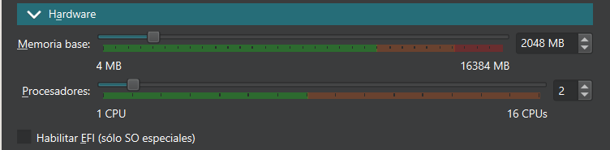
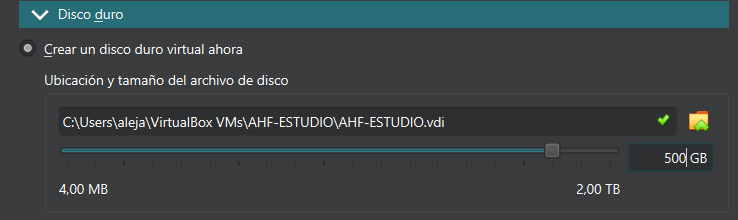
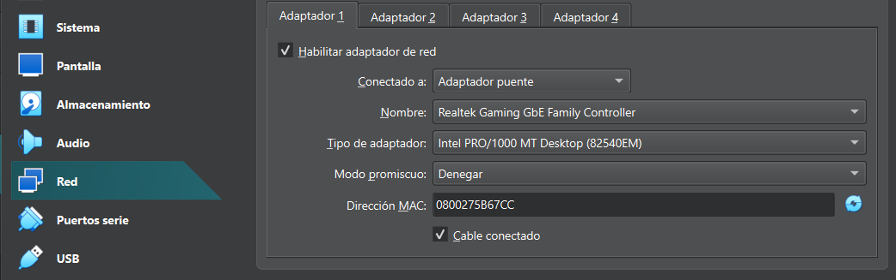
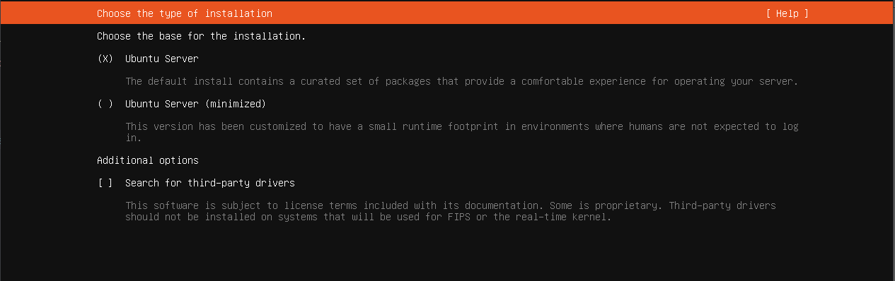
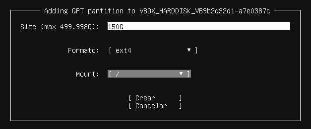
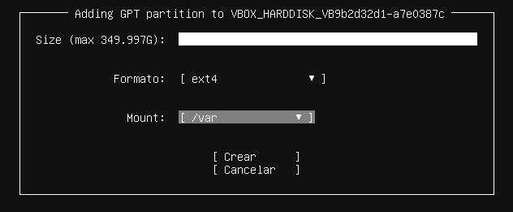
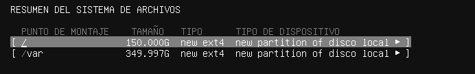
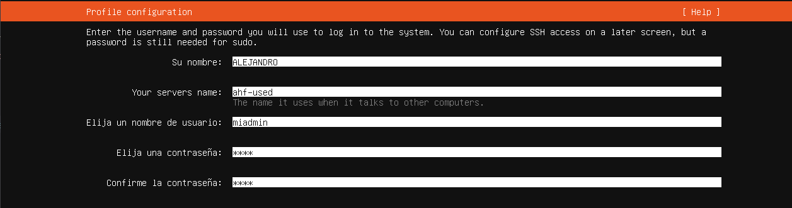
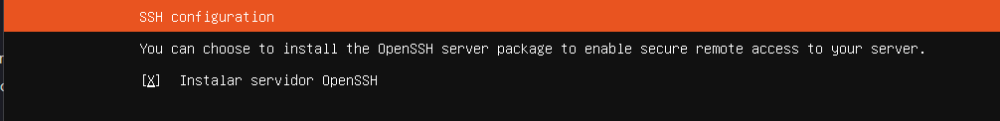

|  |
|:-----------:|
||
|INSTALACIÓN, CONFIGURACIÓN Y DOCUMENTACIÓN DEL SERVIDOR DE DESARROLLO|

- [SERVIDOR DE DESARROLLO](#servidor-de-desarrollo)
  - [1. Ubuntu Server 24.04.3 LTS](#1-ubuntu-server-24043-lts)
    - [1.1 Configuración inicial](#11-configuración-inicial)
      - [Instalación sistema operativo](#instalación-sistema-operativo)
      - [Comandos utiles](#comandos-utiles)
      - [Configuracion del sistema operativo](#configuracion-del-sistema-operativo)
        - [Configuración de red](#configuración-de-red)
        - [Fecha y hora](#fecha-y-hora)
        - [Cortafuegos](#cortafuegos)
        - [SSH](#ssh)
        - [Antivirus](#antivirus)
      - [Cuentas administradoras](#cuentas-administradoras)
    - [1.2 Servidor web Apache](#12-servidor-web-apache)
      - [Instalación](#instalación)
      - [Configuración](#configuración)
      - [Monitorización](#monitorización)
      - [Mantenimiento](#mantenimiento)
    - [1.3 PHP](#13-php)
      - [Instalación](#instalación-1)
      - [Configuración](#configuración-1)
      - [Monitorización](#monitorización-1)
      - [Mantenimiento](#mantenimiento-1)
    - [1.4 Módulos PHP](#14-módulos-php)
      - [php8.3-mysql](#php83-mysql)
      - [php8.3-xdebug](#php83-xdebug)
      - [DirectoryIndex](#directoryindex)
    - [1.5 MariaDB](#15-mariadb)
      - [Instalación](#instalación-2)
      - [Configuración](#configuración-2)
      - [Monitorización](#monitorización-2)
      - [Mantenimiento](#mantenimiento-2)
    - [1.6 Servidor Web seguro (HTTPS)](#16-servidor-web-seguro-https)
      - [Instalación](#instalación-3)
      - [Redirección de HTTP A HTTPS](#redirección-de-http-a-https)
    - [1.7 DNS](#17-dns)
    - [1.8 SFTP](#18-sftp)
      - [Enjaular usuarios](#enjaular-usuarios)
    - [1.9 Apache Tomcat](#19-apache-tomcat)
    - [1.10 LDAP](#110-ldap)
    - [1.11 phpMyAdmin](#111-phpmyadmin)
      - [Instalación](#instalación-4)
      - [Configuración](#configuración-3)
      - [Monitorización](#monitorización-3)
    - [1.12 Sitios virtuales](#112-sitios-virtuales)
      - [Tipos de Virtual Host](#tipos-de-virtual-host)
      - [Configuración del sitio1](#configuración-del-sitio1)


# SERVIDOR DE DESARROLLO

## 1. Ubuntu Server 24.04.3 LTS

Este documento es una guía detallada del proceso de instalación y configuración de un servidor de aplicaciones en Ubuntu Server utilizando Apache, con soporte PHP y MySQL.

### 1.1 Configuración inicial

#### Instalación sistema operativo

Vamos a comenzar con la instalación de nuestro sistema operativo Ubuntu Server 24.04.3 en una maquina virtual y su configuración.

**<h3>Configuración maquina virtual</h3>**

Configuramos la memoria de la maquina virtual con al menos 2GB de ram y dos procesadores.



En cuanto al almacenamiento vamos a crear un nuevo disco duro con 500GB de almacenamiento.



En cuanto a la configuración de red de la maquina debemos cambiar el adaptador de red a adaptador puente.



**<h3>Elección tipo de instalación</h3>**

Al ser la primara vez que iniciamos Ubuntu Server y nuestra maquina virtual nos dara a elegir entre tres opciones como tipo de instalación, escogeremos Ubuntu Server.



**<h3>Particiones</h3>**

Creamos dos particiones , una de 150GB para la raiz del servidor y otra del resto para /var.

La primera partición en la raiz:



La segunda con el resto del almacenamiento:



Asi quedaria el resumen de ambas particiones:



**<h3>Datos del administrador</h3>**

El siguiente paso sera la configuración tanto del nombre del servidor como del primer usuario administrador admin1 con password paso.



**<h3>Habilitar SSH</h3>**

Lo siguiente que nos preguntara es si queremos habilitar el servidor OpenSHH, le daremos a que si para asi poder trabajar con el MobaXterm y no directamente en el servidor.



#### Comandos utiles 

En esta sección estaran indicados algunos de los comandos mas usados en ubuntu server y que nos seran utiles para trabajar con este 
sistema operativo.

**<h3>Cambiar usuario en consola</h3>**
````Bash
su [nombre usuario]
exit # para salir
````

**<h3>Tipo de sistema operativo</h3>**
Para comprobar el nombre del servidor, la versión del sistema operativo instalado actualmente, la versión de kernel utilizado, tipo de arquitectura del procesador, etc.
````Bash
uname -a
hostnamectl
````

**<h3>Ver procesos</h3>**
````Bash
ps -ef
````

**<h3>Ubicación</h3>**
Para saber en que directorio estamos cuando estamos poniendo comando en la consola.
````Bash
pwd
````

**<h3>Ver datos de conexión</h3>**
Para ver los datos de ip, mac, etc de los adaptadores de red que tenemos instalados en nuestro servidor.
````Bash
ip a

hostname -I  # Para ver solo la ip asignada a nuestro nombre de host

ip r # Para ver la puerta de enlace, en la primera linea pone la 
# puerta de enlace y tambien el nombre de la tarjeta de red

resolvectl # Para ver los dns, en DNS Servers se ve cuales hay configurados, 
# tambien vemos a que dominio pertenecemos en DNS Domain
````

**<h3>Particiones</h3>**
Con todos los comandos vemos que particiones hay y de que tamaño son. El primero da mas información del tamaño usado.
````Bash
df -h
lsblk [-a][-fm][-fn]
fdisk -l
````

**<h3>Ver datos de las cuentas</h3>**

````Bash
cat /etc/passwd # datos de los usuarios
cat /etc/group # datos de los grupos
````

**<h3>Para ver los modulos activos de php</h3>**
````Bash
apache2ctl -M
````

**<h3>Para ver los sitios activos</h3>**
````Bash
apache2ctl -S
````

#### Configuracion del sistema operativo

Una vez hemos realizado la configuración incial antes de empezar a trabajar con nuestro servidor debemos de realizar una serie de configuraciones en distintos aspectos.

Actualización del sistema operativo:

````Bash
sudo apt update
sudo apt upgrade
````

Los siguientes datos son los datos que hemos configurado en una maquina limpia de Ubuntu Server la cual nos servira para realizar clonaciones para las maquinas que utilizaremos en nuestros proyectos mas adelantes , dependiendo del lugar de ejecucción de la maquina ya sea en clase o en nuestra casa los parametros cambiaran.

> **Nombre de la máquina**: ahf-usedlimpia\
> **Memoria RAM**: 2G\
> **Particiones**: 150G(/) y resto (/var)\
> **Configuración de red interface**: enp0s3 \
> **Dirección IP** :10.199.10.22/22\
> **GW**: 10.199.8.1/22\
> **DNS**: 10.151.123.21 y 10.151.126.21


##### Configuración de red

Para poder conectarnos siempre a nuestro servidor tenemos que adjudicar una ip fija la cual no cambiara dentro de nuestra red interna , para ello necesitamos editar el fichero enp0s3.yaml , el cual es una copia del archivo que viene por defecto 50-cloud-init.yaml.

Nos dirigimos al directorio con el archivo 50-cloud-init.yaml y copiamos el archivo (enpos3.yaml).

```bash
cd /etc/netplan
sudo cp 50-cloud-init.yaml 50-cloud-init.yaml.backup
```

Editamos el fichero enp0s3.yaml que acabamos de crear.

```bash
sudo nano /etc/netplan/enp0s3.yaml
```

La siguiente información varia dependiendo del lugar donde tengamos el servidor si clase o nuestra casa.
```bash
# This is the network config written by 'subiquity'
network:
  ethernets:
    enp0s3:
      addresses:
       - 10.199.10.98/22
      nameservers:
         addresses:
         - 10.151.123.21
         - 10.151.126.21
      routes:
          - to: default
             via: 10.199.8.1
         search: [educa.jcyl.es]
  version: 2
```

Cambiamos el nombre de la maquina con:
```bash
sudo hostnamectl set-hostname <nombre>
sudo nano /etc/hosts
```

Aplicamos la configuración.

```bash
sudo netplan apply
```

Si el archivo que acabamos de editar estuviera mal nos lo indicaria al aplicar la configuración de red ya que este archivo es de vital importancia.
Si la configuración es correcta no aparecera ningún aviso.

##### Fecha y hora

```bash
# Comprobamos la fecha con:
date
```
```bash
# Ponemos la zona horaria correcta para cambiar la hora
sudo timedatectl set-timezone Europe/Madrid

# Comprobamos que la fecha y/o hora han cambiado con:
date
```

**Para descargar mas idiomas**

Para desbloquear más idiomas tenemos que abrir el archivo locale.gen y descomentar lo idiomas que queremos activar.

```bash
sudo nano /etc/locale.gen
```

Para que haga efecto ejecutamos el siguiente comando.

```bash
sudo locale-gen
```

Reiniciamos el servidor apache, también algunas veces es necesario reiniciar Ubuntu.

```bash
sudo systemctl restart apache2
```
##### Cortafuegos

Activar el cortafuegos.

**Instalacion**

```bash
sudo apt update
sudo apt install ufw     # Instalamos UFW si no está instalado
```

**Configuracion**

```bash
sudo ufw enable          # Activamos el cortafuegos
sudo ufw allow 22        # Abrimos el puerto 22 (SSH)
```

Para eliminar reglas específicas (por ejemplo IPv6 o cualquier otra):

```bash
sudo ufw status numbered  # Mostramos reglas con número
sudo ufw delete <numero_regla>        # Eliminamos la regla con el número correspondiente
```

**Monitorizacion**

```bash
sudo ufw status verbose    # Mostramos el estado detallado del cortafuegos y las reglas activas
```
**Mantenimiento**

```bash
sudo ufw disable           # Desactivamos el cortafuegos temporalmente
sudo ufw reset             # Reseteamos todas las reglas a la configuración inicial
```

##### SSH

Aunque en la instalación del sistema operativo hemos activado el servidor OpenSSH , vamos a ver como instalarlo para el caso de que no lo activaramos anteriormente.

**Instalación**

```bash
sudo apt update
sudo apt install openssh-server   # Instalamos el servidor SSH
```
**Configuración**

```bash
sudo nano /etc/ssh/sshd_config   # Archivo de configuración SSH
sudo systemctl restart ssh       # Reiniciamos el servicio para aplicar cambios si hacemos
```
**Monitorización**

```bash
sudo systemctl status ssh        # Comprobamos el estado del servicio
```
**Mantenimiento**

```bash
sudo systemctl enable ssh         # Habilitamos que SSH se inicie al arrancar
sudo systemctl disable ssh        # Deshabilitamos el inicio automático si se necesita
sudo systemctl restart ssh 
``` 

##### Antivirus


**Instalacion**

Instalaremos el Antivirus `ClamAV`:
```bash
sudo apt update && sudo apt install -y clamav
```

**Configuración**

Si no quieres cambiar nada, puedes verificar la configuración.
```bash
cat /etc/clamav/clamd.conf      # Mostramos la configuración del demonio
cat /etc/clamav/freshclam.conf  # Mostramos la configuración de actualizaciones
```

Si quieres actualizar la base de datos de los virus:
```bash
sudo systemctl stop clamav-freshclam   # Detenemos el servicio de actualizaciones
sudo freshclam                         # Actualizamos la base de datos de virus
sudo systemctl start clamav-freshclam  # Volvemos a iniciar el servicio
```
**Monitorización**

```bash
sudo systemctl status clamav-daemon    # Comprobamos el estado del servicio ClamAV
sudo systemctl status clamav-freshclam # Comprobamos el estado del servicio de actualizaciones
```
**Mantenimiento**

```bash
sudo systemctl enable clamav-daemon     # Habilitamos el demonio al inicio del sistema
sudo systemctl disable clamav-daemon    # Deshabilitamos el inicio automático si se necesita
sudo systemctl restart clamav-daemon    # Reiniciamos el servicio si hay problemas
```

#### Cuentas administradoras

> - [X] root(inicio)
> - [X] miadmin/paso
> - [X] miadmin2/paso

Vamos a realizar la creacion de otro usuario administrador miadmin2 , el cual tendra los mismos grupos que miadmin.

Creacion y permisos del usuario:

```bash
sudo useradd -m -G sudo,adm,cdrom,dip,plugdev,lxd -s /bin/bash miadmin2
```

Adjudicamos una contraseña:

```bash
sudo passwd miadmin2
```

Borrar el usuario

```bash
sudo userdel miadmin2
```

Ver información de las cuentas:

```bash
cat /etc/passwd
cat /etc/group
```

**Cambiar nombre del servidor**

A partir de aqui ya hemos configurado nuestra maquina limpia con el sistema operativo de Ubuntu Server, una vez que la clonemos podemos cambiarle el nombre al servidor con los siguientes comandos.

```bash
sudo hostnamectl set-hostname ahf-used
```

También debemos cambiarlo en el archivo.

```bash
sudo nano /etc/hosts
```

### 1.2 Servidor web Apache

Servidor web de código abierto que gestiona y entrega páginas a los usuarios. \
Permite configurar sitios, manejar peticiones HTTP/HTTPS y servir contenido dinámico y estático. \
Es compatible con módulos y lenguajes como PHP, ofreciendo gran flexibilidad y personalización.

#### Instalación

Instalamos Apache: 

```bash
sudo apt update
sudo apt install apache2 -y   # Instalamos Apache
```

Abrimos el puerto 80 del cortafuegos:

```bash
sudo ufw allow 80
sudo ufw status numbered
sudo ufw delete 3
```

Verificamos el estado del servicio.

```bash
sudo systemctl status apache2
```

#### Configuración

**Permisos y usuarios**

Creamos un nuevo usuario llamado operadorweb el cual nos permitira administrar nuestra aplicación web.

> Nombre: operadorweb
> Directorio de trabajo: /var/www/html
> grupo: www-data
> shell: /bin/bash

```bash
sudo useradd -M -d /var/www/html -N -g www-data -s /bin/bash operadorweb
```

Le ponemos una contraseña.

```bash
sudo passwd operadorweb
```

Cambiamos el propietario de la carpeta /html y el grupo.

```bash
sudo chown -R operadorweb:www-data /var/www/html/
```

Cambiamos los permisos de la carpeta html.

```bash
sudo chmod -R 775 /var/www/html
```

**Archivos de configuración**

---

<!-- documentar "/etc/apache2/" y subcarpetas -->
Los archivos de configuracion de Apache se encuentran en **``/etc/apache2/``**:
  - **``apache2.conf``**: es el archivo de configuracion inicial. Es el primer fichero que se ejecuta cuando arrancamos el servidor.
  - **``ports.conf``**: donde se definen los puertos en los que Apache escuchará las conexiones
  - **``mods-available/``**: Contiene todos los módulos de Apache que están instalados en el sistema.
  - **``mods-enabled/``**: Contiene enlaces simbólicos a los módulos de mods-available/ que están activos, es decir, cargados y funcionando en el servidor.
  - **``conf-available/``**: Almacena archivos de configuración global mediante enlaces simbólicos influyendo en la configuración general del servidor.
  - **``conf-enabled/``**: Contiene enlaces simbólicos a los archivos de conf-available/ que están activos, aplicando su configuración al servidor.
  - **``sites-available/``**: Guarda archivos de configuración de sitios virtuales mediante enlaces simbólicos, permitiendo configurar diferentes sitios alojados en el mismo servidor
  - **``sites-enabled/``**: Contiene enlaces simbólicos a los archivos de sites-available/ que están activos, habilitando los sitios virtuales correspondientes.

---

Creamos la carpeta error y la damos permisos para que sea igual que html.

```bash
sudo mkdir /var/www/html/error
sudo touch /var/www/html/error/error.log
```

Redirección de errores al archivo previamente creado error.log

Hacemos una copia del archivo 000-default.conf por si surge algun imprevisto.

```bash
sudo cp 000-default.conf 000-default.conf.backup
```

Le agregamos la línea CustomLog al archivo.

```bash
sudo nano /etc/apache2/sites-available/000-default.conf
```


Para poder poner directivas solo a nuestra web lo hacemos con un archivo .htaccess, pero para poder usar este archivo primero tenemos que cambiar la configuracion de apache2.conf.

```bash
sudo nano /etc/apache2/apache2.conf
```

Buscar la sección 
<Directory /var/www/>
    Options Indexes FollowSymLinks
    AllowOverride None
    Require all granted
</Directory>

Y cambiar a 
<Directory /var/www/>
    Options Indexes FollowSymLinks
    AllowOverride All
    Require all granted
</Directory>


Aplicamos los cambios despues de editar:

```bash
sudo apache2ctl configtest      # Comprobamos que no de errores = "Syntax OK"
sudo systemctl restart apache2  # Reiniciamos el servicio para aplicar cambios
```

**Errores con .htaccess**

Al lado del index general de nuestra aplicación creamos el archivo .htaccess el cual manejara los errores 500,404 y 403 de manera personalizada. Podemos configurar el mensaje de error en el archivo agregando esta línea.

```bash
ErrorDocument 404 "Mensaje de error"
```

Normalmente se ha con los enlaces a paginas html de errores las cuales estan ubicadas en la carpeta error y nos permiten una mayor personalización.

```bash
ErrorDocument 404 /AHFDWESProyectoDWES/error/404.html
ErrorDocument 403 /AHFDWESProyectoDWES/error/403.html
ErrorDocument 500 /AHFDWESProyectoDWES/error/500.html
```

Reiniciamos Apache2.

```bash
sudo systemctl restart apache2
```

#### Monitorización

```bash
sudo systemctl status apache2   # Comprobamos si Apache está activo
sudo ufw status | grep "80"     # Verificamos que el puerto 80 está escuchando
```

Comprobamos la ubicación de las carpetas y los archivos web.

```bash
cd /var/www/html
ls
```

#### Mantenimiento

```bash
sudo systemctl start apache2     # Iniciamos el servicio si está detenido
sudo systemctl stop apache2      # Detenemos el servicio
sudo systemctl restart apache2   # Reiniciamos el servicio
sudo systemctl enable apache2    # Habilitamos el inicio automático al arrancar
sudo systemctl disable apache2   # Deshabilitamos el inicio automático si se necesita
```

### 1.3 PHP 

#### Instalación

```bash
sudo apt install php8.3-fpm php8.3
```

Reiniciamos el servicio.

```bash
sudo systemctl restart php8.3-fpm
```

#### Configuración

**<h3>Ficheros de configuración de PHP para php-fpm:</h3>**
* **/etc/php/8.3/fpm/conf.d**: Módulos instalados en esta configuración de php (enlaces simbólicos a /etc/php/8.3/mods-available)
* **/etc/php/8.3/fpm/php-fpm.conf** : Configuración general de php-fpm
* **/etc/php/8.3/fpm/php.ini** : Configuración de php para este escenario
* **/etc/php/8.3/fpm/pool.d** : Directorio con distintos pool de configuración. Cada aplicación puede tener una configuración distinta (procesos distintos) de php-fpm.

Activamos el módulo de Apache2 con PHP-FPM.

```bash
sudo a2enmod proxy_fcgi setenvif
sudo systemctl restart apache2
```

**Activarlo para cada virtualhost**

Para que se comunique entre php y el apache
 
Se pone esta expresion en el archivo /etc/apache2/sites-available/000-default.conf

```bash
  ProxyPassMatch ^/(.*\.php)$ unix:/run/php/php8.3-fpm.sock|fcgi://127.0.0.1/var/www/html
```


  
Por último activamos (o comprobamos que esta activado):

```bash
sudo a2enconf php8.3-fpm
```
**Configuración del php.ini para un archivo de configuración**

El archivo principal de configuración de PHP-FPM se encuentra en ``/etc/php/8.3/fpm/php.ini``.

Hacemos una copia de seguridad de `php.ini` y despues lo editamos cambiando estos valores:
```bash
cp php.ini php.ini.backup
```


Y reiniciamos el servicio para aplicar los cambios a la configuracion y comprobamos que esta running:
```bash
sudo systemctl restart php8.3-fpm
sudo systemctl status php8.3-fpm.service
```

**Activarlo para todos los virtualhost**

El fichero de configuración php8.3-fpmen el directorio /etc/apache2/conf-available, por defecto funciona cuando php-fpm está escuchando en un socket UNIX:

```bash
# lo abrimos con nano:
sudo nano /etc/apache2/conf-available/php8.3-fpm.conf

# Copiamos lo siguiente o comprobamos que ya está:
<FilesMatch ".+\.ph(?:ar|p|tml)$">
    SetHandler "proxy:unix:/run/php/php8.3-fpm.sock|fcgi://localhost"
</FilesMatch>
```

#### Monitorización

Comprobación de funcionamiento PHP-FPM

PHP-FPM puede escuchar por socket UNIX o TCP/IP (host:puerto). Revisar cada "pool" en Ubuntu en /etc/php/8.3/fpm/pool.d/www.conf

```bash
grep '^listen' /etc/php/8.3/fpm/pool.d/*.conf
```

Dos posibles resultados: 

Esta escuchando en socket UNIX

```bash
listen = /run/php/php8.3-fpm.sock
```
Está escuchando por TCP/IP en la dirección local

```bash
listen = 127.0.0.1:9000
```

#### Mantenimiento

```bash
sudo systemctl start php8.3-fpm      # Inicia el servicio
sudo systemctl stop php8.3-fpm       # Detiene el servicio
sudo systemctl restart php8.3-fpm    # Reinicia el servicio
sudo systemctl enable php8.3-fpm     # Habilita inicio automático al arrancar
sudo systemctl disable php8.3-fpm    # Deshabilita inicio automático
```

### 1.4 Módulos PHP

#### php8.3-mysql

Primero comprobamos la version de php que tenemos instalada

```bash
php -v
```

Acualizamos e instalamos la version acorde a nuestro php

```bash
sudo apt update
sudo apt install php8.3-mysql
```

Reiniciamos apache y php

```bash
sudo systemctl restart php8.3-fpm
sudo systemctl restart apache2
```

Mostrar que extensión se han instalado.

```bash
sudo php -m | grep mysql
```

#### php8.3-xdebug

Es un módulo de PHP que permite depurar y analizar el código de forma más sencilla. \
Permite inspeccionar variables, pausar la ejecución y seguir el flujo del programa paso a paso. \
Se integra con IDEs mediante el puerto **9003** para depuración remota.

**Instalación**

Primero, actualiza la lista de paquetes y luego instala el paquete específico para PHP 8.3:

```bash
sudo apt update
sudo apt install php8.3-xdebug
```

Habilitamos el módulo.

```bash
sudo phpenmod xdebug
```

**Configuración**

Puerto 9003, Editamos el fichero de configuración:

```bash
sudo nano /etc/php/8.3/fpm/conf.d/20-xdebug.ini
```

Y agrega lo siguiente:

```bash
xdebug.mode=develop,debug
xdebug.start_with_request=yes
xdebug.client_host=127.0.0.1
xdebug.client_port=9003
xdebug.log_level=7
xdebug.idekey="netbeans-xdebug"
xdebug.discover_client_host=1
```

Dar permisos para escribir los log

```bash
sudo touch /tmp/xdebug.log
sudo chmod 666 /tmp/xdebug.log
sudo chown root:root /tmp/xdebug.log
```

Reiniciamos todos los servicios y habilitamos xdebug.

```bash
sudo systemctl restart php8.3-fpm.service
sudo systemctl restart apache2
```

**Mantenimiento**

#### DirectoryIndex

Comprobamos si esta el modulo activo

```bash
ls /etc/apache2/mods-enabled | grep dir
```

Abrimos el dir.conf para ver el orden por defecto que tiene para abrir el index.

### 1.5 MariaDB

Sistema de gestión de bases de datos relacional y de código abierto, compatible con MySQL.
Permite almacenar, consultar y gestionar datos de forma segura y eficiente.
Se puede acceder desde aplicaciones y IDEs mediante conexión local o remota usando el puerto 3306.

#### Instalación 


```bash
sudo apt udpate
sudo apt install mariadb-server -y
```

Abrimos el puerto por el cual trabaja MariaDB 3306:

```bash
sudo ufw allow 3306
```

#### Configuración

```bash
sudo nano /etc/mysql/mariadb.conf.d/50-server.cnf
```

Editamos la línea del ``bind-address`` para permitir conexiones desde cualquier IP (por defecto solo permite localhost), cambiandolo de ``127.0.0.1`` por ``0.0.0.0`` para permitir todas las conexiones externas.

Esto permitirá conectarse a la base de datos MariaDB desde otros equipos. Para habilitar el acceso remoto al servidor mariadb desde otros equipos, debes modificar el fichero de configuración.

Reiniciamos el servicio de mariaDB:

```bash
sudo systemctl restart mariadb
```

**Comprobación del puerto usado por el servidor Mariadb**

```bash
sudo ss -punta |grep mariadb
tcp   LISTEN  0  80  127.0.0.1:3306   0.0.0.0:*   users:(("mariadbd",pid=1234,fd=10))
```

**Listar los procesos en ejecución relacionados con el servidor mariadb**

```bash
sudo ps -aux |grep maria
```

**Creación de un usuario administrador que utilice autenticación con constraseña**

Entramos en la consola de mariadb

```bash
sudo mariadb
```

Creación del usuario que usaremos para conectarnos a la base de datos.

```sql
GRANT ALL ON *.* TO 'adminsql'@'%' IDENTIFIED BY 'paso' WITH GRANT OPTION;
```

**Instalar módulo pdo_mysql**

Para que funcione el poder usar la clase PDO desde php. (Ver aqui guia de instalación [php8.3-mariadb](#14-módulos-php)).

#### Monitorización 

Comandos utiles para el servicio de MariaBD.


````Bash
# Iniciar el servicio	
sudo systemctl start mariadb
# Detener el servicio	
sudo systemctl stop mariadb
# Reiniciar el servicio	
sudo systemctl restart mariadb
# Ver estado del servicio	
sudo systemctl status mariadb
# Habilitar inicio automático	
sudo systemctl enable mariadb
# Deshabilitar inicio automático	
sudo systemctl disable mariadb
# Ver versión instalada	
mariadb --version	Muestra la versión actual de MariaDB instalada.
````

#### Mantenimiento
| **Acción**                         | **Comando**                      | **Descripción**                                              |
| ---------------------------------- | -------------------------------- | ------------------------------------------------------------ |
| **Iniciar el servicio**            | `sudo systemctl start mariadb`   | Inicia el servidor MariaDB.                                  |
| **Detener el servicio**            | `sudo systemctl stop mariadb`    | Detiene el servidor MariaDB.                                 |
| **Reiniciar el servicio**          | `sudo systemctl restart mariadb` | Reinicia el servidor.                                        |
| **Ver estado del servicio**        | `sudo systemctl status mariadb`  | Muestra si el servidor está activo o inactivo.               |
| **Habilitar inicio automático**    | `sudo systemctl enable mariadb`  | Configura el servicio para iniciarse al arrancar el sistema. |
| **Deshabilitar inicio automático** | `sudo systemctl disable mariadb` | Evita que el servicio se inicie automáticamente.             |
| **Ver versión instalada**          | `mariadb --version`              | Muestra la versión actual de MariaDB instalada.              |

Comprobamos si PHP detecta los módulos de MySQL/MariaDB:

```bash
sudo php -m | grep mysql
```

### 1.6 Servidor Web seguro (HTTPS)

#### Instalación

Generamos un certificado autofirmado y su clave privada (válido 1 año), y rellenamos la info que nos pide.

```bash
sudo openssl req -x509 -nodes -days 365 -newkey rsa:2048 -keyout /etc/ssl/private/ahf-used.key -out /etc/ssl/certs/ahf-used.crt
```
Rellenamos la información solicitada: 

```bash
Country Name (2 letter code) [AU]:ES
State or Province Name (full name) [Some-State]:ZAMORA
Locality Name (eg, city) []:BENAVENTE
Organization Name (eg, company) [Internet Widgits Pty Ltd]:IES LOS SAUCES
Organizational Unit Name (eg, section) []:INFORMATICA
Common Name (e.g. server FQDN or YOUR name) []:ahf-used
Email Address []:alejandro.huefer@educa.jcyl.es
```
#### Redirección de HTTP A HTTPS

Activamos el módulo:

```bash
sudo a2enmod rewrite
```

En el archivo .htaccess:

```bash
RewriteEngine On
RewriteCond %{SERVER_PORT} 80
RewriteRule ^(.*)$ https://192.168.1.100/$1 [R,L]
```
Comprobamos que se han creado

```bash
sudo ls -l /etc/ssl/certs/ | grep ahf-used
sudo ls -l /etc/ssl/private/ | grep ahf-used
```

Habilitamnos el modulo ssh, y configuramos un sitio para que lo use.

```bash
sudo a2enmod ssl
sudo systemctl restart apache2
cd /etc/apache2/sites-available/
sudo cp default-ssl.conf ahf-used.conf
sudo nano ahf-used.conf
```


Habilitamos el sitio y reiniciamos apache para aplicar cambios.
```bash
sudo a2ensite ahf-used.conf
sudo systemctl reload apache2
```

Para terminar, abrimos el puerto 443 para permitir HTTPS.
```bash
sudo ufw allow 443
```
Borramos la regla 443 (V6) que se ha creado.

```bash
sudo ufw status numbered # Mostramos reglas numeradas

sudo ufw delete <numero_regla> # Borramos la regla
```

Activamos el módulo:

```bash
sudo a2enmod rewrite
```

En el archivo .htaccess

```bash
RewriteEngine On
RewriteCond %{SERVER_PORT} 80
RewriteRule ^(.*)$ https://10.199.8.153/$1 [R,L]
```

### 1.7 DNS

### 1.8 SFTP

SFTP no necesita instalarse, viene incluido dentro del OpenSSH instalado previamente. Solo debemos asegurarnos de que el servidor SSH esté instalado:

```bash
sudo systemctl status ssh
```

Si no esta, lo instalamos con:

```bash
sudo apt update
sudo apt install openssh-server -y 
sudo systemctl restart ssh
```

Comandos para controlarlo

```bash
sudo systemctl start ssh      # Iniciar el servicio
sudo systemctl stop ssh       # Detener el servicio
sudo systemctl restart ssh    # Reiniciar para aplicar cambios
sudo systemctl enable ssh     # Habilitar inicio automático
sudo systemctl disable ssh    # Deshabilitar inicio automático
```

#### Enjaular usuarios

Creamos el grupo ftpusers.

```bash
sudo groupadd sftpusers
```

Creamos el usuario usuarioenjaulado1 con carpeta home var/www/usuarioenjaulado1 y le ponemos contraseña

```bash
sudo useradd -g www-data -G sftpusers -m -d /var/www/usuarioenjaulado1 usuarioenjaulado1
sudo passwd usuarioenjaulado1
```

Cambiamos el propietario y los permisos al home del usuario para que pertenezca al root.

```bash
sudo chown root:root /var/www/usuarioenjaulado1
sudo chmod 555 /var/www/usuarioenjaulado1
```

Creamos una carpeta dentro que será la que el usuarioenjaulado1 puede escribir.

```bash
sudo mkdir /var/www/usuarioenjaulado1/httpdocs
sudo chmod 2775 -R /var/www/usuarioenjaulado1/httpdocs
sudo chown usuarioenjaulado1:www-data -R /var/www/usuarioenjaulado1/httpdocs
```

Copia de seguridad de /etc/ssh/sshd_config.d

```bash
sudo cp /etc/ssh/sshd_config /etc/ssh/sshd_config.backup
```

y lo modificamos con

```bash
sudo nano /etc/ssh/sshd_config
```

```bash
Subsystem sftp internal-sftp
Match Group sftpusers
ChrootDirectory %h
ForceCommand internal-sftp -u 2
AllowTcpForwarding yes
PermitTunnel no
X11Forwarding no
```

Reiniciamos ssh

```bash
sudo systemctl restart ssh
```

### 1.9 Apache Tomcat

### 1.10 LDAP

### 1.11 phpMyAdmin

#### Instalación

```bash
sudo apt update
sudo apt install phpmyadmin
```

Elegiremos Apache2.

Indicamos que si queremos crear la base de datos.


Elegimos una password.


#### Configuración

Creamos enlace simbólico del archivo apache.conf en conf-available.

```bash
sudo ln -sf /etc/phpmyadmin/apache.conf /etc/apache2/conf-available/phpmyadmin.conf
```

Habilitamos la configuración de phpmyadmin.

```bash
sudo a2enconf phpmyadmin
```

Reiniciar apache

```bash
sudo systemctl restart apache2
```

#### Monitorización

Probamos en el navegador con nuestra ip/phpmyadmin y usamos el usuario y contraseña de mariadb (adminsql/paso).

```bash
https://10.199.8.153/phpmyadmin/
```

### 1.12 Sitios virtuales

Apache nos permite alojar varios sitios web en el mismo servidor usando:

> El mismo servidor físico
> La misma dirección IP.
> Puertos diferentes o el mismo puerto.
> Distintos nombres de dominio o carpetas raiz.


Los sitios web se configuran un los archivos .conf dentro de: **/etc/apache2/sites-available/**

Para activarlos utilizaremos el siguiente comando:

```bash
sudo a2ensite archivo.conf
```

#### Tipos de Virtual Host

> Virtual Host por nombre

Es el sitio virtual mas común , apache decide que sitio mostrar dependiendo el dominio que ingrese el usuario.

Todos pueden usar la misma IP pero Apache sabe cual mostrar gracias al dominio.

Ejemplo de configuración:

```bash
<VirtualHost *:80>
    ServerName www.miweb.com
    DocumentRoot /var/www/miweb
</VirtualHost>

<VirtualHost *:80>
    ServerName tienda.miweb.com
    DocumentRoot /var/www/tienda
</VirtualHost>
```

> Virtual Host por puerto

Segun el puerto se muestra un sitio u otro.

Lo típico es:

- Puerto 80: HTTP
- Puerto 443: HTTPS
  
Ejemplo de configuración:

```bash
<VirtualHost *:80>
    ServerName ahf-used
    DocumentRoot /var/www/html
</VirtualHost>

<VirtualHost *:443>
    ServerName ahf-used
    DocumentRoot /var/www/html
    SSLEngine on
    SSLCertificateFile /etc/ssl/certs/ahf-used.crt
    SSLCertificateKeyFile /etc/ssl/private/ahf-used.key
</VirtualHost>
```

> Virtual Host por IP

Cada sitio tiene su propia IP. Se usa muy poco hoy en dia.

**Sitios virtuales que ya tenemos**

Como deciamos anteriromente podemos acceder a estos archivos .conf en el siguiente directorio:

```bash
/etc/apache2/sites-available/
```

> 000-default.conf — sitio HTTP por defecto.
> 
> default-ssl.conf — sitio HTTPS por defecto.
> 
> wordpress.conf — tu sitio WordPress.
> 
> ahf-used.conf — tus certificados.

Cuando activamos un sitio nuevo se copia simbolicamente en:

```bash
/etc/apache2/sites-enabled/
```

**Como sabe Apache que sitio usar**

Utilizando el siguiente comando:

```bash
sudo apache2ctl -S
```
Nos indiara la siguiente ingormación:


- Qué sitio usa el puerto 80
- Qué sitio usa el puerto 443
- Qué archivo .conf controla cada uno
- Qué ServerName tiene cada uno


#### Configuración del sitio1

Vamos a crear un nuevo sitio virtual en el cual solo puede actuar el usuarioenjaulado1 el cual creamos anteriromente.

- Lo primero que debemos hacer en Plesk es crear un nuevo DNS - hOSTING Y dns -> DNS -> Nuevo registro


- Rellenamos con los datops de nuestro servisdor en local.


- Nos saldra un aviso y le daremos a actualizar.


**Configuración del sitio1 en apache**

- Por si no tenemos la carpeta error en el directorio de usuarioenjaulado, la creamos y le damos permisos igual que a httpdocs.

```bash
sudo mkdir /var/www/usuarioenjaulado1/error
sudo chmod 2775 -R /var/www/usuarioenjaulado1/error
sudo chown usuarioenjaulado1:www-data -R /var/www/usuarioenjaulado1/error
```

- Hacemos copia de seguridad del archivo por defecto para los sitio http y abrimos la copia en este caso sitio1.conf

```bash
sudo cp /etc/apache2/sites-available/000-default.conf /etc/apache2/sites-available/sitio1.conf
sudo nano /etc/apache2/sites-available/sitio1.conf
```

- Por si necesitamos hacer la copia del archivo para https en vez del otro.


```bash
sudo cp /etc/apache2/sites-available/default-ssl.conf /etc/apache2/sites-available/sitio1.conf
```

Configuramos el archivo sitio1.conf (el que era http).

```bash
<VirtualHost *:80>

  ServerName sitio1.alejandrohuefer.ieslossauces.es

  ServerAdmin webmaster@localhost
  DocumentRoot /var/www/usuarioenjaulado1/httpdocs

  ErrorLog ${APACHE_LOG_DIR}/error-sitio1.log
  ErrorLog /var/www/usuarioenjaulado1/error/error.log
  CustomLog ${APACHE_LOG_DIR}/access-sitio1.log combined
  ProxyPassMatch ^/(.*\.php)$ unix:/run/php/php8.3-fpm.sock|fcgi://127.0.0.1/var/www/usuarioenjaulado1/httpdocs

</VirtualHost>
```

- Quedaria asi el archivo:


- Lo siguiente sera habilitar y asegurarnos que la configuración no tenga errores.


```bash
# Habilita el nuevo sitio
sudo a2ensite sitio1.conf

# Deshabilita el sitio por defecto de Apache (opcional, si no lo necesitas)
sudo a2dissite 000-default.conf

# Verifica que la configuración de Apache no tenga errores
sudo apache2ctl configtest

# Recarga el servicio de Apache para aplicar los cambios
sudo systemctl reload apache2
```

**Unicamente deberia de haber 3 sisitos activos (000-default.conf, sitio1.conf y ahf-used.conf)**

Para ver que sitios tenemos activos utilizamos el siguiente comando:

```bash
apache2ctl -S
```


